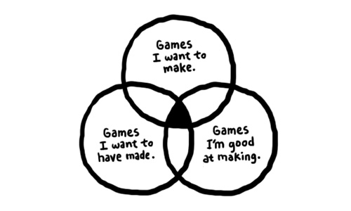
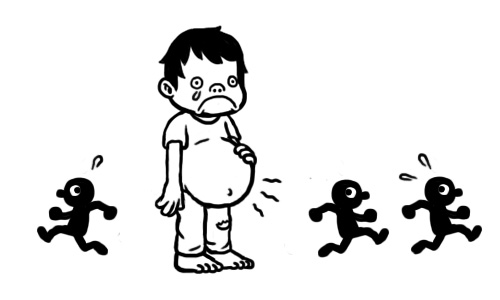
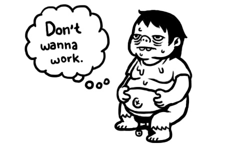
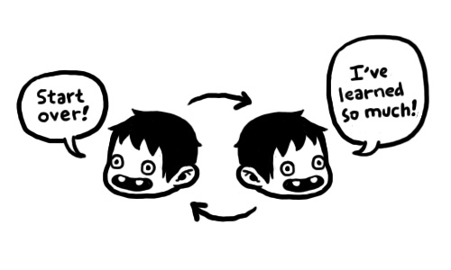
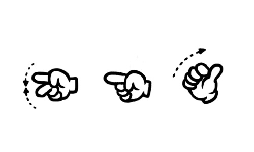

As I work towards completing [my own game](https://href.li/?http://spelunkyworld.com/), I’ve been thinking a lot about finishing projects in general. I’ve noticed that there are a lot of talented developers out there that have trouble finishing games. Truthfully, I’ve left a long trail of unfinished games in my wake… I think everyone has. Not every project is going to pan out, for whatever reason. But if you find yourself consistently backing out of game projects that have a lot of potential, it could be worth taking a step back and examining why this happens.

We’ve all had that feeling about at least one game, comic book, movie, etc., that comes out: “Gee, I could do better than this! This is overrated.” But it’s important to take a step back and realize that, hey, they put in the time to finish a project and I haven’t. That’s at least one thing they might be better than me at, and it’s probably why they have the recognition I don’t! If you treat finishing like a skill, rather than simply a step in the process, you can acknowledge not only that it’s something you can get better at, but also what habits and thought processes get in your way.

I don’t believe that there’s a right way to make games. It’s a creative endeavor, so there are no hard and fast rules that can’t be broken at some point. But as a game developer who has discussed this problem with other game developers, I feel like there are some mental traps that we all fall into at some point, especially when we’re starting out. Being aware of these traps is a great first step towards finishing something. (Between you and me, codifying these ideas is partly my way of staying on top of them, too!)

So without further ado, here is a list of 15 tips for finishing a game:

## 1\. CHOOSE AN IDEA WITH POTENTIAL

I’ve found that there are three types of games that pique my interest: games I want to make, games I want to have made, and games I’m good at making.

_Games I want to make_ are games where the process itself seems really fun. Maybe the mechanic seems really fun to experiment with, or maybe there’s a character I really want to animate.

_Games I want to have made_ are games where I’m more interested in the result than in getting there. Maybe it’s a “no-limits” concept (“OMG, GTA meets Final Fantasy meets Starcraft meets…”) or just a neat idea that’s not necessarily any fun to implement.

_Games I’m good at making_ are games that are suited to my personality and which I have experience in making. Perhaps there’s a certain genre that you naturally gravitate towards and which you understand the rhythm and flow of very well.

In my opinion, the ideas with the most potential (to be finished, at least) fall into all three categories and also satisfy the requirement “I have the time and resources to actually make this”.

## 2\. ACTUALLY START THE DAMN GAME

Writing your idea down is not starting the damn game. Writing a design document is not starting the damn game. Assembling a team is not starting the damn game. Even doing graphics or music is not starting the damn game. It’s easy to confuse “preparing to start the damn game” with “starting the damn game”. Just remember: a damn game can be played, and if you have not created something that can be played, it’s not a damn game!

So dammit, even creating a game engine is not necessarily starting the damn game. Which brings me to the next tip…

## 3\. DON’T ROLL YOUR OWN TECH IF YOU DON’T HAVE TO

There are pros and cons to writing your own engine. But ask yourself, do you really have to? Is what you want to do impossible to do with what’s already out there or would you be reinventing the wheel? Of course, if you write your own engine you can make it just perfect the way you like it. But be honest, how often do you ever get past the engine to the game itself? Do you find yourself making game engines more often than you do games?

I made the original version of Spelunky in [Game Maker](https://href.li/?http://www.yoyogames.com/make), and it’s that “finished” game that eventually gave me the opportunity to work on an Xbox 360 version. So don’t ever feel that game-making software or other simplified tools are somehow illegitimate. The important thing is the game.

_Link: [The Independent Gaming Forums Technical Forums](https://href.li/?http://forums.tigsource.com/index.php?board=4.0)_

## 4\. PROTOTYPE

This goes with #2: prototype first with whatever you have available. Sometimes you find out right off the bat that it’s a bad idea. Sometimes you stumble upon an even BETTER idea. Either way, I usually find it difficult to figure out what I want to commit to until I actually start making something. So make something!

## 5\. MAKE SURE THE CORE MECHANICS ARE FUN

Find core mechanics that are just fun to play around with. It should be fun to execute the most basic interactions, because that’s what players will be doing the most when they play your game. Ultimately, you want this core to drive your development. This will make it a lot easier for you later on when you have to cut out parts of the game (#13) - you’ll always have this core to fall back to.

It’s possible, while prototyping, that you discover a mechanic that’s MORE fun than what you originally thought the core mechanic was - consider making that the new core mechanic!

## 6\. CHOOSE GOOD PARTNERS (OR WORK ALONE AS LONG AS YOU CAN)

Finding a good game-making partner is like dating in a lot of ways. You may think that all that matters is skill: “Oh cool, I’m a programmer, and this guy’s an artist… let’s DO THIS!” But no, there are other things to consider, like personality, experience, timing, and mutual interest. Like a romantic relationship, you don’t want to be in a position where either you or the other person is far less dedicated. Test each other out a bit with some smaller projects, because it can really be devastating when a key person drops out after months or years of development.

Another great thing about having finished projects is that your partners will know what you’re capable of and will feel more comfortable working with you. It’s hard to convince anyone experienced to work with you on an idea alone, considering how few ideas actually see the light of day (and how hard it is to see the value in some ideas until they’ve been executed). Good partners will want to see your finished games. So finish them!

Alternatively, find free graphics and music to use online, at least as placeholders (at The Independent Gaming Source we had [a competition](https://href.li/?http://www.derekyu.com/tigs/assemblee/) in which a lot of free art and music was created). Use ASCII if you have to. As an artist, I know I’d much rather contribute to a project that is already done but just missing art. And if you need a coder… consider learning to code yourself (if I can do it, you can, too!) or picking up some game-making software (see #3).

## 7\. GRIND IS NORMAL - FACTOR IT INTO YOUR PLAN

A lot of game-making is tedious and downright unfun. It’s not play, it’s work (and this is why you should choke out ANYONE when they joke about you “playing games all day”). At some point you’ll suddenly realize that there’s all this stuff you never thought about when you were planning your project and prototyping - stuff like menus, screen transitions, saving and loading, etc. “Shoot! I was imagining this amazing world I was going to create, or this fun mechanic I was going to experiment with… I didn’t think I’d be spending weeks making functional menus that don’t look like crap!" Or, you know, there’s stuff that’s fun in small doses, like animating characters, that becomes nightmarish when you realize you’ve set yourself up for 100 different characters.

Once you go through it a couple of times, you’ll realize how important it is to scale your project so that you don’t spend too much time in this inevitable quagmire ("too much time” being however long it takes before you quit). You’ll also realize that a lot of this boring stuff is what makes the game feel complete! A nice title screen, for example, does wonders to make a game feel legitimate.

## 8\. USE AWARDS, COMPETITIONS, AND OTHER EVENTS AS REAL DEADLINES

When Alec and I were working on [Aquaria](https://href.li/?http://www.bit-blot.com/aquaria/), the Independent Games Festival submission deadline forced us to make hard decisions about the direction we were taking and it also forced us to look at our schedule more realistically. Had we not had that deadline, I’m not entirely certain we would have finished! Competitions are great to participate in because the deadlines are very real and because the rewards (recognition, awards, possibly money) are very real. Also, they can give you a way to connect with a community of like-minded people.

_Links: [Independent Games Festival](https://href.li/?http://igf.com/), [Ludum Dare](https://href.li/?http://www.ludumdare.com/)_

## 9\. PUSH FORWARD

Feeling stuck? Push forward. Start working on the next level, the next enemy, the next whatever. Not only is it helpful for motivational purposes, but you want to get a sense for how your whole game will play out. Just like writing - you don’t want to go through it sentence by sentence, making sure every sentence is perfect before you move on. Get an outline down.

## 10\. TAKE CARE OF YOUR MENTAL AND PHYSICAL HEALTH

It can be surprisingly hard to take care of yourself when you’re focused on finishing a game. But honestly, you’re only doing your game-making a disservice by not sleeping, exercising, or eating right. At best, you’re preventing yourself from working at your full potential and making it more likely that you’ll quit. Having some doubt about your project is perfectly natural, but getting depression or falling into illness is not. It’s amazing how much you can not want to work on your dream project when your mind and body feels like crap!

## 11\. STOP MAKING EXCUSES FOR STARTING OVER

_“My code’s a mess. And I’ve learned so much already. If I started over I could do it a lot better and faster, and then the rest of the game will go a lot faster, too!”_

STOP. NO. This is true at some point during every game’s development. Your code will always be a mess. You will have learned a lot. It will never be perfect. And if you start all over, you’ll find yourself in the exact same situation when you get to this point again. It’s a terrible trap to think like this.

Here’s a joke: a man spends his entire life working on a game engine so perfect that all he has to do is press one button and the perfect game will come out of it. Actually, it’s not much of a joke, because the punchline is that he never finishes it! No such engine or game exists.

If bad organization is really slowing you down, go back and do some surgery on it so that you feel better. If it works but it’s a bit hacky, then be brave and press on!

## 12\. SAVE IT FOR THE NEXT GAME

So partway through development you have this great new idea that’s going to blow everyone’s mind, but you’ll have to redo your whole game to implement it? Save it for the next game! Right? This won’t be the last game you ever make, hopefully. Save it for the next one… but finish this one first!

## 13\. CUT. IT. OUT.

Oh shit, you’re way behind schedule. You have all these ideas but they’ll colonize Mars before you have a chance to implement half of them. Oh woe is you… BUT WAIT!

Well, that’s great, actually! Because now you’re forced to decide what is really important to your game, and what you could cut. The fact is, if we all had unlimited resources and unlimited time, we’d all make the same crappy, meandering everything game and there’d be no reason to play at all. It’s our limited resources and time that forces us to make tight games that feel like they have a purpose.

If you’ve been building upon some core concepts that are provably fun, just keep cutting until you get to the very edge of that core. Everything else is probably just fluff you could do without. Or worse, it’s fluff that’s preventing people from seeing the best parts of your game.

## 14\. IF YOU DO QUIT, SCALE DOWN, NOT UP

Okay, sometimes it is time to call it quits. Maybe there’s just no way you’ll ever finish, and what you have is too big a mess to cut anything out. Maybe the rest of your team has quit already. My hope in writing this list is to help people avoid this possibility, but hey, maybe you’re just coming off of such a project. And sometimes… shit just happens.

If there’s no salvaging it, at least make sure that you scale down your next project. It’s easy to set your sights higher and higher, even as your projects become less and less finished. “My SKILLS are improving! I’m learning from my failure,” is a common excuse. But I think this is why it’s important to treat finishing as a skill, too.

So go back down, down, down, down to a point where you may even find it somewhat beneath you. For example, instead of jumping from your 4x space sim to your 4x space sim IN 3D, try making a great game that focuses on one small element of space sims. And if you can’t finish that, try something more like Asteroids. It’s very possible that it’ll still end up being a bigger struggle than you thought (and/or more fun to make than you thought)!

## 15\. THE LAST 10 PERCENT

They say the last 10 percent is really 90 percent, and there is truth to this. It’s the details that end up taking a long time. Sure, maybe you coded a competent combat system in a week… but making it great and making it complex (and bug-free)… these things can take months. The honest truth is that you’ll probably do a “final lap” sprint many times before you get to the real final lap.

If this sounds discouraging, it shouldn’t. While the last 10 percent is harrowing, I’ve also found that is an enormously satisfying time in the development. Because more often than not, stuff really does seem to “just come together” at the end if you’ve been spending your time properly, and turning a jumble of mish-mashed ideas and content into sweet gaming manna is a magical feeling.

It’s all about the details.

AND FINALLY… RELEASE!

Holy crap, you released a game! Congratulations, you just leveled up, big time. Benefits include: increased confidence, a reputation for being able to complete projects, and an understanding of the entire process of game creation! The best part, though, is that you have a nice little game that I can play and enjoy! And I do like playing games, almost as much as I enjoy making them.

No more standing on the sidelines, friend: YOU ARE A GAME DEVELOPER.