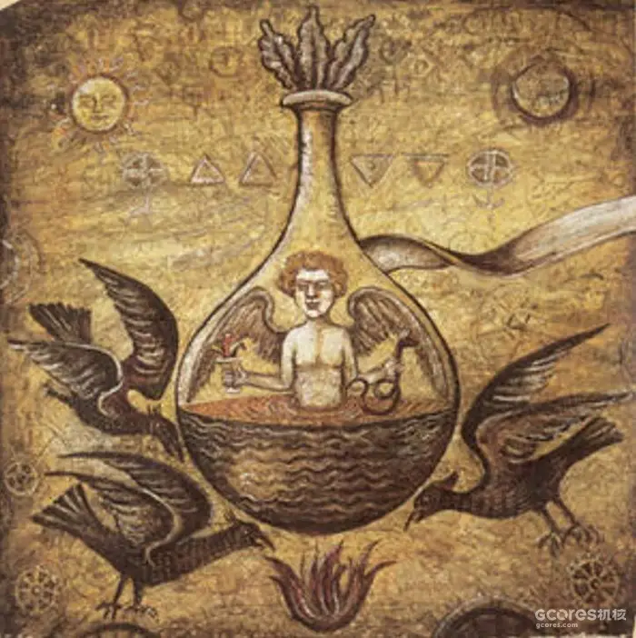
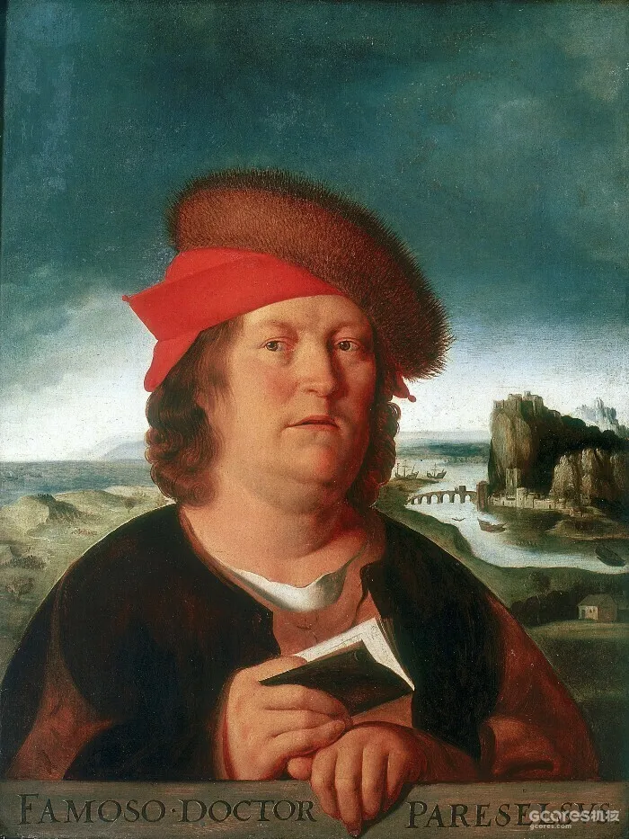
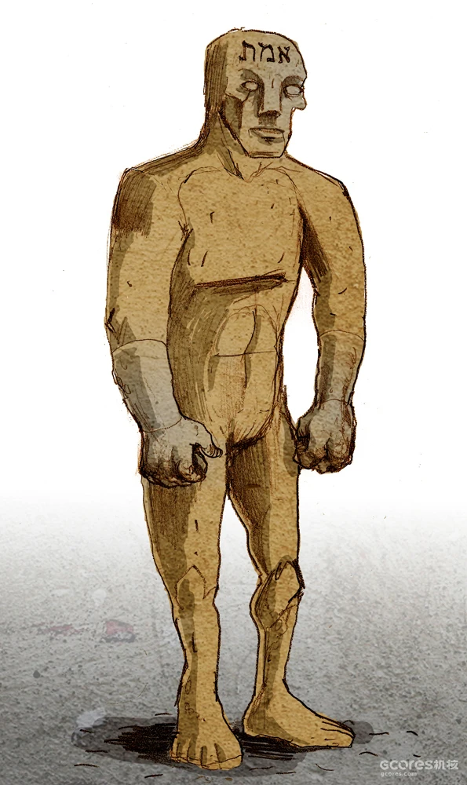
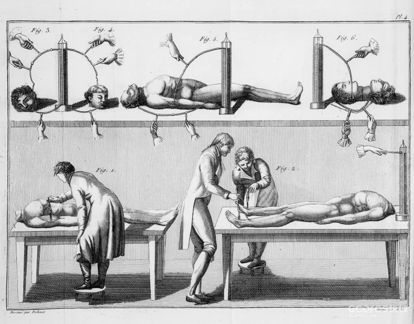

瓶中小人或烧瓶里的小人，即十六世纪的炼金术师帕拉塞尔苏斯所说的homunculus，在拉丁语中意为“小人”，指的是一个微型的、完全成形的人。

在《钢之炼金术师》中登场的人造人霍尔蒙克斯（Homunculus）均是以贤者之石为核心构成的人型生物，并且拥有常人不能想象的能力，其制造者是「父亲」。

八个人造人组成了这个动画的主要反派，父亲是首领，其他七个以七宗罪命名的反派为他工作。在最接近漫画的2009版动画中，七宗罪（Homunuli）是由叫做父亲的原始人造人（Homunculus）创造的，目的是为了摆脱自己的恶，变得更加强大。他从自己身上取下赋予他力量的贤者之石的一部分，并将其插入人类宿主或他用所需材料制造的空壳中。

这种将炼金术小人等同于贤哲之石的说法可能源自心理学家卡尔·古斯塔夫·荣格（1875－1961），荣格认为这个概念首次出现在公元三世纪写的《佐西莫斯的幻觉》中：佐西莫斯遇到了一个牧师，他变成了“自己的反面，变成了一个残缺的人形\[anthroparion\]”；而希腊语中的“anthroparion”与“homunculus”相似，都是“人”的缩小形式。荣格在他的评论中把“小人”等同于贤者之石。

不过，在《钢炼》中缺乏从原始炼金术文本中看到的那种怪诞而复杂的过程，但它仍然抓住了炼金术和创造炼金小人的核心思想和哲学。它的中心思想是在一个更神圣的力量之外创造生命，但又与之相连。这些生物的创造以贤者之石为中心，而贤者之石又是由人类灵魂的能量混合而成的，因此与更高的力量和灵魂的存在有联系。

从某种意义上说，我们可以把它们与从粘土中创造出来的人造生命的格莱姆泥人（golem）联系起来。两者之间的区别在于，虽然小人是一个小而精确的人类代表——甚至带有一些残缺的灵魂碎片——但泥人只是一个无意识的机器人，执行创造者告诉它的任何任务，没有意志和智慧。

虽然格莱姆和小人的具体细节非常不同，但这两个概念都隐喻了人与神的关系，以神的自身形象建造生命。

因此，钢炼和原始炼金术的终极目标是一致的，它们都不是「贱金属成金」（chrysopoeia），而是人工生成人类。

但与帕拉塞尔苏斯的原始炼金术不同的是，钢炼中的人造人可能不涉及相同数量的动物授精，但确实和血液和死亡有关，绕过了使用精液作为他们的灵魂成分，而直接进入了灵魂本身。

在“经典”炼金术中，制造「小人」的关键正是人类精液。

## 预成论

在文艺复兴时期的医学中，人们认为生殖的主要生命力来自于男人的精液形式。子宫只是一个温暖、营养丰富的容器，供胚胎生长和滋养，尽管子宫提供了制造成人所需的原材料，但胎儿用来成熟的原材料在决定这个人将成为什么样的人方面很重要。

这种认为精液是在子宫内产生新生命所需的主要成分，而子宫只是一个被动的容器的观点可以追溯到亚里士多德，他是中世纪和古典末期自然科学的主要权威。

亚里士多德并不认为人类可以在自然的性繁殖和生育模式之外进行人工制造，但他的想法确实留下了这种可能性。如果人类的子宫只是胎儿的一个容器，那么理论上它可以与另一个容器交换，只要使用人类的精液。除了精子之外，人们认为所需要的只是一个温暖的房间和某种原材料，甚至可以是腐烂的肉。

▲预成论（认为生物体的所有部分在生殖细胞时已完全成形而成长时只是增加尺寸的理论）学派认为精子的头部含有在子宫内发育的小人。由于文艺复兴时期的学者将炼金术视为一种艺术——毕竟它的拉丁文名称之一是ars divina（神圣的艺术）——它使神话和事实之间的界限更加模糊，创造了一个一切似乎都能实现的空间。

当然，这只是对「自发生成」的普遍信念的一种表达：认为生物可能在腐烂物质的肥沃基质中无中生有。大约300年前，亚里士多德在他的《论动物的产生》一书中，解释了这一过程是如何产生害虫的，如昆虫和老鼠。

在过去，对这种技术狂妄的担心主要是针对通过人工手段制造人类的建议，或者像希腊人所说的那样，通过技术，艺术。如果说在古代制造人类的想法带有一丝禁忌的味道，那么原因更多的是对技术的普遍不信任，而不是对造人的不赞同。以这种方式制造新生命并不是在“扮演神”。

这些关于人类生殖的早期想法早已被否定，但它们使小人的创造在中世纪和文艺复兴时期看起来像今天的克隆一样合理。

## 小人配方

到了中世纪早期，炼金术士和哲学家们已经开始编撰制造小人的配方。一份名为《牛之书》的文本中描述了一个复杂的过程，即必须用精液和一种磷光矿物的混合物对母牛或母羊进行人工授精。如果一切按计划进行，母牛将怀孕并生下一个无形状的、蠕动的物体，将其放在一个大铅碗或玻璃碗中的太阳石、硫磺、磁铁、绿色的tutia（一种铁的硫酸盐）和白柳树汁液的混合物中。然后，无定形的圆球应该开始呈现出人形，并凝结成一个可识别的形状，然后在铅制容器中保存三天。

在这段时间里，这个生物会变得非常饥饿，所以要给它喂食它被斩首的母亲的血液，持续七天。期间，它应该发育成一个完全成熟的小而怪异的人形，并带有一些人类灵魂的碎片。

其他配方要求用一只母猴代替，剩下的是用一只身份不明的雌性动物。

16世纪的炼金术士帕拉塞尔苏斯提出了一个配方，指示炼金术士对一匹马进行人工授精，让精液在子宫内腐烂。他还认为，只要把精子放在装有腐肉甚至粪便等材料的密封容器中，就可以创造出一个小人！他在《物性论》（De Natura Rerum）一书中提供的说明如下：

让一个男人的精子在葫芦瓶里腐烂，密封起来，用最高程度的马粪腐烂，持续四十天，或这么久，直到很容易看到它开始有生命、移动和蠕动。过了这段时间，它就会变得像人一样，但却是透明的，没有身体。在这之后，如果它每天都被谨慎地滋养，用人血之奥秘\[Arcanum of Mans blood\]来喂养，并在四十个星期的时间里一直保持着马的热量，它就会成为一个真正的、活生生的婴儿，拥有女人所生的婴儿的所有器官，但它会小得多。这就是我们所说的霍尔蒙克斯（Homunculus）或人造人。此后要像其他婴儿一样小心翼翼地抚养他，直到他长大成人。现在，这是神向凡人、罪人揭示的最大秘密之一。因为这是一个奇迹，是神的伟大奇迹之一，是所有秘密中的秘密，理应保存在秘密中，直到最后的时代，那时没有什么是隐藏的\[天启\]，而是所有事情都显露出来。

帕拉塞尔苏斯并没有用小人来施展魔法，而是指示应该“以最大的关怀和热情来教育它，直到它长大并开始显示智慧”。帕拉塞尔苏斯还声称，制造小人的程序是神向凡人透露的最大秘密之一，这或许暗示创造人造生命是人类可以利用的神圣智慧。

小人的形象体现了炼金术士的信念，即宇宙是一个统一的整体，它的每一部分都体现了使万物生机勃勃的神性力量。他们认为，宇宙本身就是一种人，即亚当·卡德蒙（Adam Kadmon），而我们每个人都是一个微观世界，一个宇宙的缩影。宇宙是一个伟大的人，而我们都是小宇宙。小人是我们的“内在观察者”，通过培育自己的小人，炼金术士可以观察和评估这个观察者的形状——因此，小人不仅代表知识，而且代表“关于知识的知识”。

## 小人能做什么？

小人在炼金术中拥有如此重要的地位，那么它对一个从业的中世纪炼金术士来说必然会有很多用途。

如果把它放在一块白布上，手里拿着一面镜子，用人血和其他成分的混合物熏蒸，月亮就会在一个月的最后一天出现满月。如果把它斩首，把它的血给一个人喝，这个人就会变成牛或羊的形状；但如果用它涂抹，他就会变成猿猴的形状。如果在一间黑暗的房子里喂养小人四十天，以血和牛奶为食，然后从它的肚子里掏出内脏，抹在某人的手上和脚上，他可能会在水上行走，或在眨眼之间环游世界。活着的时候保持一年，然后放在牛奶和雨水的浴池里，它就会说出发生在远方的事情，这或许是小人可以赋予的重要的能力之一。

其他类型的小人赋予炼金术士看到、交谈和与精神互动的能力，如果炼金术士足够大胆，甚至可以与恶魔互动。而其他类型的怪物则赋予炼金术士在一定程度上控制天气的能力，或创造出剧毒的毒蛇。

虽然这一切听起来肯定是纯粹的迷信和传说，并掺杂着对生命和自然界运作方式的不完美理解，但还是有许多关于成功创造真正的小人描述。在英国女王伊丽莎白一世统治时期，一位名叫约翰·迪的炼金术士据说变出了几个小人，作为女王的间谍，其想法是他们可以躲在房间的阴影里偷听敌人。还有一个小人，据说是由一位名叫皮埃尔·博雷尔医生的皇家医生为法国国王路易十四用人血培育的，据说它可以从头上发射光束。

然而，正如埃米尔·贝塞兹尼博士的《斯芬克斯》（1873年）一书中所全面记录的那样，最突出的案例肯定是16世纪末的两位奥地利炼金术士——约翰·费迪南·冯·库夫施泰因伯爵和阿贝·格洛尼在短短五周内创造了十个小人。所有十个小人都会回答有关未来事件的问题，并总是正确预测结果。

## 非自然的人造人

创造小人的部分想法是创造一个人造人，这使它可以与犹太教的格莱姆（golem）故事相提并论，格莱姆可以由一个特别正义的拉比从灰尘中创造。教会中的一些领导人反对制造小人，因为这被认为是渎神，而且认为创造一个类似人类的智能生物只是为了当仆人是不对的。

当神学家对炼金术士声称他们可以制造一种叫做“小人”的人造生物而皱眉时，他们的理由不一定是我们想象的那样。他们的指控并不是在玩弄神，而是在逼迫神出手。因为尽管我们可能能够以这种神秘的方式使物质具有生命力，但只有神才能赋予它灵魂。那么，神是否必须介入，为小人提供灵魂？而且，由于它不是由亚当的血统所生，所以没有原罪，因此不需要救赎？

这些都是困扰教士们的问题。也许它们也困扰着小人：在歌德对这个古老故事的重述中，浮士德的助手瓦格纳创造的小人渴望成为完全的人类，因为只有这样他才能摆脱制造他的玻璃容器。他说：“我自己渴望出生。”

玛丽·雪莱的医生和他的畸形作品现在用于对所有新的科学干预生命的下意识反应而引用。他们在媒体对体外受精和克隆、植物作物的基因改造以及现在通过合成生物学创造“合成生命形式”的报道中占据了突出位置。

意思很明确：这样标榜的技术是不自然和危险的东西，值得我们坚决反对。

## 小人伦理

合成生物学所面临的一些反感来自于这种长期的偏见。在现代的世俗版本中，人类生命的神圣性已经扩大到包括所有的自然界，而我们如果敢于干预活物，就有可能受到自然的谴责。

这样一来，小人的叙述就体现了现代关于基因工程和控制论的辩论。现代“炼金术士”努力从基因改造和控制论中制造“小人”。对这些现代企业的许多反对意见与对创造小人的反对意见非常相似，特别是关于小人是否可以被视为完整的人的辩论。

许多人认为小人是强大的，但智力和推理能力有限，因此他们是亚人类，可以奴役它们。但并不是所有人都同意小人天生就是奴隶，有些人坚持认为小人必须有理性的灵魂。

这反映了今天类似的辩论，即应该如何对待基因改造的个体和人工智能？他们能否等同于基因起点的生物人类？应该赋予他们与人类相同的权利吗？他们有灵魂吗？当昨天的炼金术士的梦想——人工生命，成为今天的科学家和工程师的真正发明和创造时，小人的奇怪想法在今天令人惊讶地不谋而合。

▲老彼得·勃鲁盖尔（Pieter Bruegel the Elder）在1558年左右的印刷品中描绘的炼金术士的形象。其中显示了一个混乱的实验室，到处都是用具，烟火缭绕，一个专家在那里紧急工作以制造黄金，而他的家庭却在他周围陷入混乱。勃鲁盖尔的这幅画为此后两个多世纪的炼金术士印象定下了基调，他们往往表现为有趣的人物，从事着愚蠢的探索，与现实世界完全脱节。