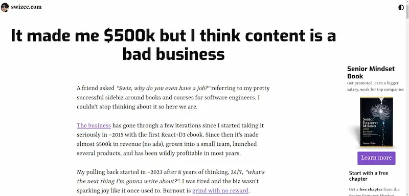

有一个行业，这些年蒸蒸日上，快速增长，加入的人越来越多。

它就是内容行业，生产各种各样的内容：文字、图片、音乐、影视、短视频、直播……

为什么内容行业这么兴旺？

因为现代人的时间，都花在网上。网上有什么？就是有内容啊。人们越是投入互联网，内容行业就越兴旺。

很多人被这个行业吸引，一门心思为互联网炮制内容，因为生产成本低，需求多，市场大，获利快……但是他们未必知道，它也有吃人的一面。

今天，我想分享一个老外程序员的[文章](https://swizec.com/blog/it-made-me-500k-but-i-think-content-is-a-bad-business/)。他是前端程序员跳槽到内容行业，干了8年，不想干了，写了自己的体会，披露这个行业的内幕。

2015年的时候，流行"知识付费"。他受到了影响，就写了一本 React + D3 的教程，放到网上卖，作为付费内容。

结果，反响不错，真的有不少人掏钱。

他受到了鼓舞，觉得内容行业可以干，赚钱容易，后来索性全职来做。

他加大力度，在网上宣传自己的内容，不断更新，推出系列课程，还拍视频。生意这样做大了，他忙不过来，就雇了兼职员工，组建了团队。

几年下来，他算了一下，单单 React + D3 这一门课，就赚了近50万美元。

他总结出来，内容行业的商业模式是：免费内容用于建立受众，然后再通过广告或收费内容获利。

内容创作者遵循这样一个公式。

你的大部分时间用来扩大受众。 你不断培养这些受众，作为销售内容的市场。 你创造可以获利的内容产品，投向这个市场。 重复第一步。 这个公式能够运作起来的关键是，你必须定期推出一些真正有意思或者真正有用的内容，才能培养出受众，激起他们的兴趣，愿意关注你，等待接下来的内容。这是在内容行业长期生存的唯一方法。

但是这样做，意味着你不能停下来，会非常累。如果你停止生产新内容，就无法找到新的受众，老的受众也会流失。

那个老外程序员就遇到了这个问题。到了2023年，他实在干不动了，对自己写的内容充满倦怠，想要休息一下。他说：“每一天，我都在想接下来要写什么？太累了，这些事情不再像以前那样带来快乐了。”

他就停下来了，想歇一段时间，恢复精力了再回来干。

但是，他马上发现，一旦停止工作，不更新也不宣传自己的内容，他的课程销售立刻就慢了下来。再过一两个月，几乎就停止盈利了。

这就是内容创造者面临的最大问题：你不能停止工作，也不能重复使用以前的内容，必须保持更新和宣传，紧跟市场的热点，这样才有人来消费你的内容，否则一切就会回到起点。

这个问题的根本原因是，内容行业是快餐文化，热点随时切换，人们只对新的内容感兴趣，快速抛弃旧内容。而且，热点切换速度正在加快，这一周的互联网热点，下周就被遗忘了，你只有加快生产速度，才跟得上。

这就是内容行业的缺点：生产出来的内容只被消费一次，以前的内容一旦被消费过，未来就不构成新的刺激了。你必须生产新的内容，带给受众新的刺激，才会有新的消费。

这注定了，内容创作者不能停下来，必须挖空心思，不断想出以前没有写过/拍过的新内容，否则你以前的投入就没用了。最终，你就陷入了一种周而复始、停不出来、把自己消耗光的怪圈。

那个老外程序员得出结论：自己是这个行业的一次性消耗品，等到被消耗光，再也写不出新东西，就是市场抛弃你的时候。

想明白这一点，他就知道自己回不到以前了，厌倦了那种炮制内容的生活，于是下定决心，放弃现在的付费课程，退出内容行业。这篇文章就是他临走的告别心声。

我希望，加入内容行业的人，都能了解这个行业的快餐本质，这里没有积累，只会掏空你。加入的时候，最好就有思想准备自己被消耗光。

\===此处有分隔线===

最后，我还想提一下"知识付费"。

知识付费也有同样的问题。你生产的付费课程，并不是真正的积累，一旦停止推广和更新，就会无人问津。

此外，它还受到 AI 的威胁。针对初学者的课程，以前还能赚到一些钱。现在有了 ChatGPT，初学者课程这门生意可能已经死掉了，因为 AI 可以回答所有的新手问题，而且回答得比你好。

AI 不能提供的，大概只有那些来之不易的深刻见解和体悟，但是它们很难包装成可以销售的课程，只能在实践中通过高手指点和自己摸索获得。

所以，知识付费在 AI 时代，前景很难说，它的最高峰可能已经过去了。

!!!light 版权声明
本文作者：[Fermi](https://fermi.ink/about)
本文链接：[https://fermi.ink/posts/2024/10/25/01/](https://fermi.ink/posts/2024/10/25/01//.)
转载标题：【转载】内容行业的内幕 —— Fermi
许可说明：本站所有文章除特别声明外均为博主原创作品，遵循 [知识共享（CC BY-NC-SA 4.0）许可协议](http://creativecommons.org/licenses/by-nc-sa/4.0/ "BY-NC-SA")进行许可。非商业转载请注明原文出处（作者，原文链接）和本声明！商业转载请联系作者获得授权。
!!!