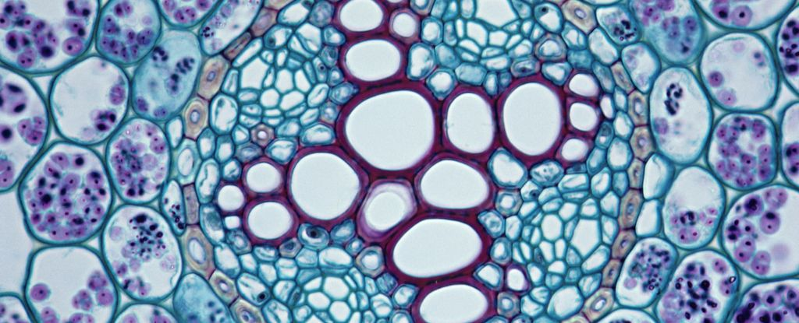

耶鲁大学的研究团队认为，他们终于弄清了为什么陆地植物会进化出如此复杂的“血管”系统——这个谜团已经存在了大约一个世纪。

大约5亿年前，当陆地植物首次出现时，它们内部的管束结构非常简单。

> 引用高中生物教科书上的说法
> 
> 导管：导管的主要功能是运输水和无机盐。导管细胞的原生质体和横壁消失，纵壁增厚并木质化，是死细胞。
> 
> 筛管：筛管的主要功能是运输有机物质。组成筛管的细胞壁较薄，含有原生质体，细胞核消失，是活细胞。上、下细胞间的横壁上有许多小孔，称为筛孔。具有筛孔的细胞壁称为筛板。筛管细胞的原生质通过筛孔相连，成为有机物运输的通道。
> 
> 植物体内，导管、管胞、木质纤维和木质薄壁细胞聚集在一起，形成木质部；筛管、伴胞、韧皮纤维和韧皮薄壁细胞聚集在一起，形成韧皮部。由木质部和韧皮部共同组成的束状结构称为维管束。

  
Ranunculus (buttercup) root under the microscope. (Ed Reschke/Getty Images)

它们的根和茎的内部看起来有点像吸管，可以从周围环境中吸收水分和养分。

然而，大约4.2亿年前，简单的吸水系统显著变化，逐渐将“吸管”分化成更精细的形状、结构和大小。

近100年来，科学家们不知道这些更复杂的内部结构在进化中有何收益，但对化石记录的最新分析表明，更现代的系统具有更强的耐旱性。

作者总结说，水资源缺乏可能是最初塑造植物内部形态的原因。

地球上最早的陆地植物是小型的、简单的、类似苔藓的形式。它们没有根系，这意味着它们被限制在水源充足的区域。

最古老的维管植物只有几厘米高，只能生活在潮湿的环境里。

随着植物进一步向内陆迁移到更干旱的地区，它们需要新的方法来捕获水、阳光和养分，同时尽量避免蒸发和脱水。

这就是树枝和根派上用场的地方。然而，与此同时，结构也带来了新的挑战。

在干旱期间，植物很容易变干，产生气泡——有点像栓塞，会阻止水从根部向上流动。

在简单而原始的血管系统中，植物内部的气泡可以很容易地扩散到其他通道，从而对进一步堵塞水和营养物质。结果可能引发组织死亡，甚至可能杀死整株植物。

研究人员对化石记录中保存的现代和灭绝植物的各种血管系统进行建模，显示更精细的血管模式可以减少气泡生成和影响。

当构成植物血管系统的维管束分化出不同图案后，分裂出的气泡就不会漂入邻近通道，导致大规模堵塞。

这使研究人员得出结论，干旱是植物维管系统的“理论上合理的”选择压力。

耶鲁大学环境学院的植物生理学家 Craig Brodersen 解释说：“每当植物偏离圆柱形血管系统时，只要它发生一点点变化，植物就会因抵御干旱的能力而获得回报。如果奖励一直存在，那么它将迫使植物远离古老的圆柱形吸管系统，转向更复杂的形式。通过这些非常小变化，植物解决了这个他们必须在地球历史早期就解决的问题，否则今天的森林就不会存在。”

这些发现不仅揭示了地球历史的有趣截面，还有助于解释今天在现代植物中看到的维管系统是如何形成的，并为未来的解决方案提供了依据。

如果专家们能够培育出更好的根系和维管系统，那么一些农作物或许能够在更干旱的环境里生长。

该研究发表在《科学》杂志上。

