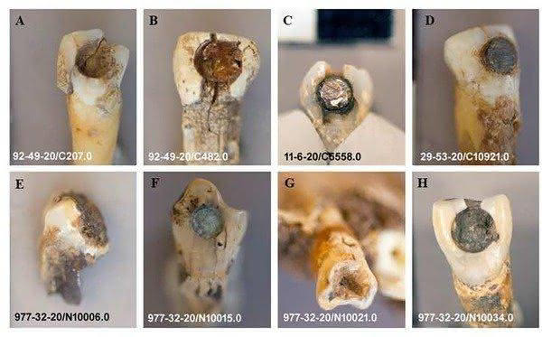

古代玛雅人以他们的牙齿为荣。早在欧洲人用黄金填充他们的蛀牙之前，中美洲的居民就已被玉石、绿松石、黄金、黑玉或赤铁矿宝石迷住了。当玛雅人漏齿而笑时，可以闪花对面人的眼睛。

无论男女贫富，许多玛雅人都会在年轻时去看牙医，给牙齿钻孔并填充珠宝、宝石或矿物质。

镶嵌物将持续一生，并可能具有精神上的含义。但金光闪闪可能不是纯粹的审美需求。

将宝石粘合到玛雅人牙齿上的“石膏”，经新研究发现，它们有一些潜在的卫生和医疗特性。

密封剂不仅具有令人难以置信的粘性(将宝石固定在原地一千多年)，其成分还具有抵抗蛀牙、减少口腔炎症和感染的潜力。

有机成分的丰富混合物让考古学家认为这种类似水泥的物质不仅仅是用作防水胶水。

相反，在刚成年时，将小石头附着在门牙和犬齿上，可能有防止蛀牙的保护牙齿的功效。

玛雅牙医的钻孔技术非常熟练，很少影响牙髓的神经和血管。

  
(Hernández-Bolio 等人，考古科学杂志，2022 年)

研究中的古代牙齿样本来自危地马拉、伯利兹和洪都拉斯的三处玛雅考古遗址，这些牙齿所属的个体似乎并非来自社会上层。

在用于将宝石附着在牙齿上的密封剂中，研究人员发现了 150 种常见于植物树脂中的有机分子。根据牙齿来自尤卡坦半岛的位置，每种密封剂混合物的成分表略有不同，但主要成分基本相同。

大多数牙科粘固剂显示出与松树焦油相关的化合物，被认为具有类似抗菌的特性。8颗牙齿中的两颗残留着香紫苏内酯，一种具有抗菌和抗真菌特性的植物化合物。它也经常用于香水行业——因为闻起来很香。

来自薄荷科植物的精油在密封剂中也很常见，这表明它有潜在的抗炎作用。

这些发现并不完全出乎意料。有许多证据表明古代玛雅人非常重视牙齿卫生。在这个文明中，人们经常擦亮他们的牙齿，坏掉的牙齿都被早早拔掉了。

然而，古玛雅人的牙科实践在历史上被当时更华丽的装饰所掩盖。玛雅人牙齿的边缘经常被锉成尖尖的形状，然后镶嵌宝石。过去，这仅归咎于仪式或美学原因。

玛雅镶嵌牙显然是一种艺术形式，但新发现表明，广泛使用的牙齿装饰可能不仅仅是出于美观。

大量人群接受牙医治疗的事实也表明，装饰不一定反映该人的社会地位。

“虽然这些混合物在提供持久的牙齿填充物方面既复杂又有效，但抽样个体的坟墓环境表明这些不是当时的社会精英。”作者写道。

该研究发表在《考古科学杂志：报告》上。