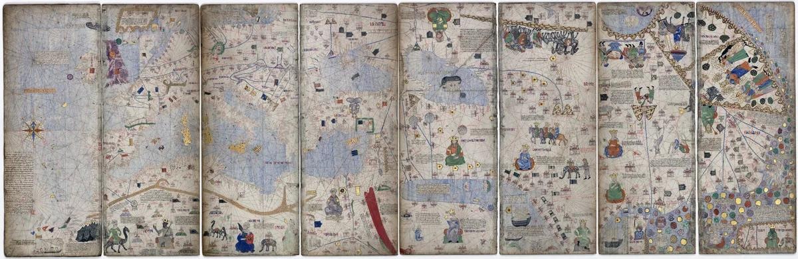

地图制作的历史是人类探索数百年的尝试和错误。地图随着新的重要信息而发展，但也保留了关于想象中的怪物和地方的特征。

在没有空中旅行和卫星的发明之前，古代的人如何制作地图呢？世界各地的古代地图制作者依靠艺术、探索、数学天赋和丰富的想象力，捕捉到他们所知道的、以及他们认为存在的广阔土地。在许多情况下，这些早期地图不仅是导航的代表，而且也是对未知奇迹的窗口。

## 他们是怎么做到的

答案可能会令一些人不满意，但它相当简单：时间，很长很长的时间。今天，我们习惯于快速获得技术和知识方面的新洞见和发展，但地图制作的历史却相当缓慢。它是由一代代旅行者、探险家、地理学家、制图师、数学家、历史学家和其他学者拼凑出不同的信息碎片而组成的。因此，这些早期产品基于一些现实的测量数据，但也包含了很多推测。

早在公元前，希腊七贤之一的Anaximander就是第一位绘制详细“已知世界”的人。现在我们强调“已知世界”这个词，因为Anaximander的圆形地图显示了希腊（世界的中心）和欧洲、南亚和北非的部分地区。对于这位贤者来说，这些大陆在被环绕的水域中组成了一个圆。重要的是，当时认为地球是平的。

这可能会激发一些读者对地球某种概念的信仰，但这种想法很快就被推翻了。公元前一世纪，另一位希腊文化大师——赛因斯的Eratosthenes通过比较亚历山大图书馆收集的广泛调查结果，成功地计算出了行星的周长（精度惊人）。虽然在此之前许多人已经认为地球是圆的，但我们没有记录他们如何尝试测量其周长——但我们在这个例子中有。

Eratosthenes方法非常简单，当今任何人都可以做到：他测量了一根垂直杆子在两个城市中同一天所投下的影子的长度。然后，他从两个城市之间的南北距离和角度中设计出一个比率，从而计算出了地球的大小。

尽管他得出了这样的结果，但是对于一些人来说，扁平地球的地图仍然流传了一段时间，直到最终消失。再次强调，人们已经知道地球是圆的很长时间了。

Eratosthenes还开发了一种更精确地定位位置的方法。他使用了类似于我们现代地图上看到的网格系统，将世界分成了若干部分。这些线条网格可以让人们估算他们与任何已知位置的距离。他还将已知世界分成了五个气候带——两个温带、两个冰冻的南北极区和一个包围赤道的热带区。所有这些特征的结合产生了一个更为复杂的地图，可以提供世界的详细描述。

## 托勒密的世界

随着罗马和希腊地图制作者继续从旅行者和行军部队那里收集信息，地图变得越来越复杂。由此产生的测量和记载成果让Claudius Ptolemy（托勒密）写出了极具影响力的八卷本《地理学》和随之而来的地图。托勒密是另一位文化大师，他写下了许多影响深远的科学文本，许多后来的伊斯兰和欧洲学者都使用了他的作品。

Ptolemy的作品编制于公元150年左右，也很大程度上基于早期的来源和编制材料。然而，让他更具影响力的是，他提供了一步一步的解释，说明他是如何制作地图的，以便其他人可以复制他的技术。他的《地理学》也充满了所有他所知道的特征的详细坐标（超过8000个地方），他还发明了纬度和经度的概念，这至今仍在使用。

《地理学》通过君士坦丁堡传入欧洲，在15世纪时，伊斯兰学者对Ptolemy的作品进行了检查、核实，甚至修改，伊斯兰地图制作者将地图的北方朝上。托勒密重新发现的作品和穆罕默德·艾德里西等有影响的地理学家制作的新地图在荷兰、意大利和法国的地图制作者和探险家中非常受欢迎，一直流传到18世纪中期。Christopher Columbus（哥伦布）受到Ptolemy（不准确的）关于亚洲的描述的启发，他相信这将带他找到容易获得的财富——显然，我们都知道他最终发现了什么。

## 变革的风

地图制作历史上的一个重大发展是磁罗盘的发明。虽然关于磁性的知识要早得多，但可靠的可用于导航的设备的应用并不是一直被采用的，直到13世纪左右才开始。在很多方面，它们的发明使得许多旧地图在导航方面变得更或者更少过时。其后，出现了港口地图，这是一种供旅行者在港口之间导航使用的航海指南。这些地图设计成可以从任何角度查看，使用了从中心点延伸出来的风向线。

卡塔兰地图册是一个丰富、详细的港口地图的绝佳示例，由地图制作者们通过编制来自各种来源的信息而制作，为法国国王查尔斯五世而制作。目前尚不清楚是谁制作了这张地图，但通常被归因于亚伯拉罕·克雷斯克和他的儿子雅胡达，他们是著名的马略卡制图学派的一员。

卡塔兰地图册既是港口地图，又是对世界的主题表现，它被想象成世界上的模样。尽管它充满了真实地方的细节，但也包含了许多奇异的事物。例如，非洲的南端和亚洲的东端都被表示为一些神秘的山脉和沙漠。这些地图也常常包含了海怪和奇怪的人形生物，这些都是古代地图制作者对未知的探索和想象的产物。

卡塔兰地图册是在14世纪晚期制作的，这是地图制作历史上的一个转折点。在随后的几个世纪中，地图制作变得越来越精确，同时也越来越复杂。随着航海技术的发展，人们可以更远地探索世界，同时也需要更好的地图来指导他们的航行。

在18世纪和19世纪，地图制作变得越来越精细和科学。这些地图通常是由测量团队实地测量而来，然后由制图师使用这些数据来创建精确的地图。这些地图的制作通常需要数年的时间和大量的资金，但结果是一张精确、详细的地图，可以被用于各种目的，从军事行动到商业交易和科学研究。

## 总结

在卫星发明之前，古代人制作地图的主要方法是通过探索、艺术和数学天赋来捕捉他们所知道的、以及他们认为存在的广阔土地。他们使用了一些现实的测量数据，但也包含了很多推测和想象的成分。随着时间的推移，地图变得越来越复杂，越来越精确，直到如今我们可以使用卫星图像制作出非常详细的地图。