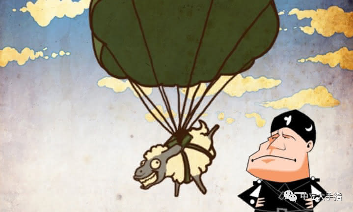
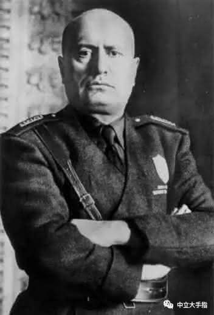
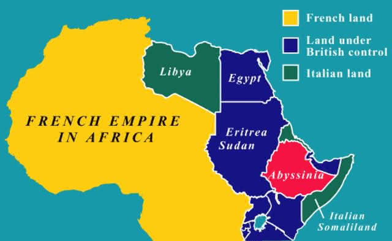
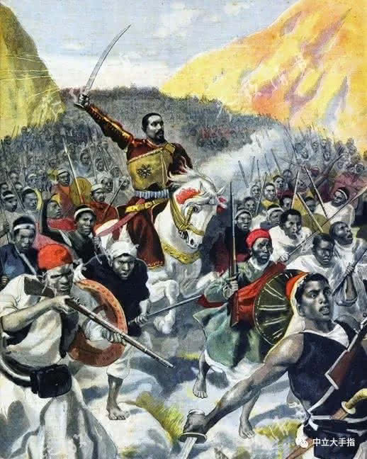
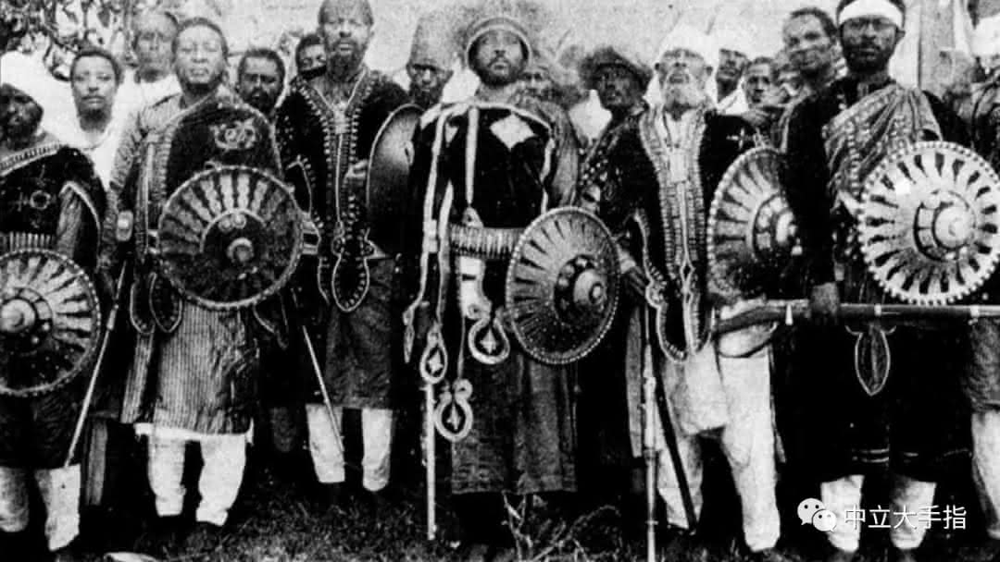
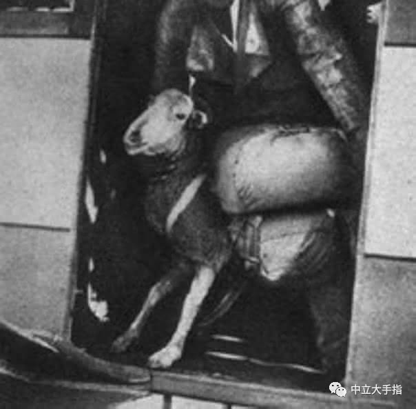
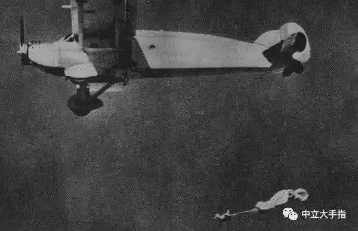

首先这不是一个笑话， 本文根据有据可查的文件谈到了一个真实的事实，曾有一只绵羊敢死队从飞机上跳伞，完成了决定一场战争胜负的重要任务。

一只羊肯定学不会怎么背降落伞，这种事业不大像这些穷羊们的主动选择。肯定是有人把羊仔们挂上降落伞，并从飞机上推下来。谁会干出如此疯狂的事呢？我不是很确定，但有很大的把握认为是意大利人。

一旦了解原因和结果，你会发现这不是一个特别疯狂的想法，虽然初衷可能与你想象的完全不同。

1922年，意大利法西斯主义领导人贝尼托·墨索里尼在政变后夺取了政权。墨索里尼是一个非常好定义的角色，把他想成是卡通人物就可以。这个疯狂的独裁者以迪士尼动画中那种八岁小孩都看得懂的弱智而爆笑的方式到处使坏，当然下场也和动画片里的大坏蛋差不多。

墨索里尼深信自己能够创造一个古罗马那样的骄傲帝国。但这个南欧国家既没有钱，也没有相应的资源建立和维护现代军队，和法国、德国这样的大肌霸邻居打仗对墨索里尼而言并不是一个好的选择。所以最好打那些无力反抗的国家的主意，这位皇帝决定把他的新罗马帝国搬去非洲。

我不会忘记降落伞，我只是觉得这事需要一个上下文。近代以前，意大利一直是分散的城邦制国家，直到1861年才形成统一的意大利王国。意大利统一之后走上了对外扩张的殖民道路，在十九世纪中期成功蚕食了非洲东海岸的交通要地厄立特里亚和南索马里。与这两片地区相邻的阿比尼西亚是一个独立国家，也就是现在的埃塞俄比亚。

入侵埃塞俄比亚看起来好像不太难，毕竟意大利已经把这里包围了。

1894年第一次意埃战役爆发，意大利仗着船坚炮利妄图吞并埃塞俄比亚，没想到一举创造了世界战争史上的一个奇迹，武装到牙齿的帝国主义军队被玩弄长矛弓箭的土人打的满地找牙。虽然有人说那时的埃塞俄比亚有志建设一支现代化的军队，但相信我，埃塞俄比亚军队的火器在这场战争中基本没起到任何作用。作为一个盛产艺术家和画家的国家，浪漫青年们搞搞文艺复兴还可以，打仗的话还是算了。

1896年3月的阿杜瓦战役中，意大利人被埃塞俄比亚国王孟尼利克二世的带领的近卫军打的全盘崩溃，被迫同埃塞俄比亚大帝国签订了《亚的斯亚贝巴条约》，割地加赔款丢光了西方世界的老脸。按照德国宰相俾斯麦的话说就是“一口烂牙却在非洲乱咬，最后什么都没有咬到”。

意大利这个国家的近代史用一句话形容，就是没有德国的命却得了德国的病。眼看着老邻居德国在希特勒的带领下文治武功风生水起，自己还在和非洲国家签订丧权辱国的不平等条约，高傲的墨索里尼肯定咽不下这口气。这位独裁者上任后的第一件事就是准备一雪前耻，拿埃塞俄比亚开刀。

1934年12月5日，意大利军队不宣而战，偷袭埃塞俄比亚城市瓦尔瓦尔。埃塞俄比亚国王海尔·塞拉西一世跑到国际联盟中抗议，我们都知道这个机构和联合国一样是没有什么用的，没人批评意大利。于是意大利于1935年10月3日再度入侵，启动了第二次意埃战争。

回头说下埃塞尔比亚，这个继承了3000年前努比亚王国衣钵的国家有非洲雄狮之称，可见其在很长时间内都是个不好惹的角色。问题该非洲雄狮乃绝对的雄狮而不是相对的雄狮，十七世纪西方殖民者是饿狼你是雄狮没问题，二十世纪帝国主义的坦克都咕叽咕叽碾上来了你还是雄狮这就非常尴尬了。作为世界上最穷同时也是最落后的国家之一，埃塞俄比亚的军队战斗力可想而知，也就是能打打意大利而已。

如今一带一路走进了非洲，黑命贵更是政治正确，所以吾等刁民安敢在此饶舌，捡听点的说就是黑叔叔真的缺乏忧患精神。孟尼利克二世一死，埃塞俄比亚马上开始了非洲国家传统保留项目内战，一直打到1930年才由海尔·塞拉西一世再度完成形式上的统一。这老哥海损不错，上台的第一件事就知道模仿西方改革颁布宪法，但别人搞君主立宪制他搞立宪君主制，宪法第一条就是“君主权力世袭且至高无上”，自己颁本法律让自己当皇帝还不是美滋滋。

海尔哥哥的皇帝没当几年，就听说几十年前来过的那群白人又来找死。于是大家高高兴兴的磨亮了大刀，走老少爷们打鬼子去！结果上了战场才发现意大利人已经骑兵换坦克了，信鸽换飞机了，他娘的意大利炮也拉上来了，我这边手上还是几十年前的鸟枪，这仗还怎么打？

虽然网上那些黑意大利军队的段子不能全信，但意大利军队也不是网上意吹嘴里坚韧不拔的铁军（是的连意大利军队的战斗力也有人吹），在二战中的表现实际上也不比那些段子好。这种情况要是换成同时代的德军，三个师一个月保证收拾的利利索索，但特别有出息的意大利硬是出动了二十多万人，和埃塞俄比亚鸟枪队对打了整整七个月，中途还差点被赶下海，最后祭出毒气战才扭转了战局。意大利的解释是毒气属于对等报复，因为埃军使用了割鸡鸡这种古老而残忍的方式对待战俘。

  

战争的中途，墨索里尼已经急不可耐。连个埃塞尔比亚都搞不定还怎么把地中海变成新罗马帝国的内湖？伟大的卡通领袖决定出奇制胜，派遣一只军队穿过恶劣的达纳基尔沙漠，截断埃塞俄比亚军队的后路。

达纳基尔沙漠以猛烈的火山、炎热的天气、有毒气体以及硫磺湖泊而著称。这些特色让达纳基尔沙漠成为了地球上最无情的世界，也成为了意大利人即将面对的严峻的后勤考验。在这片自带背景音乐的虚无之境，建立任何补给线都属于天方夜谭，但我们的卡通领袖却不以为然。

作为伟大的创新者，意大利人引领了文艺复兴，同样将再度引领军事后勤领域的变革。意识到每增加一磅的负重都会导致士兵脱水和中暑的风险急剧增加后，意大利人决定采取空投的方式为部队运送补给，25架运输机将把部队每一天都需要的物资空投在集合点，包括72只羊。在这样紧急的行军中羊能有什么作用呢？原来意大利人发现羊比骡子或者骆驼更能适应沙漠的炎热气候，它们娇小的身躯便于空投，并且有很强的载重能力。

正如你想象的那样，72只羊承担了整只部队的负重任务。这些羊成为了决定战争胜负的关键，当意大利人赶着羊出现在埃军的后方时，埃塞俄比亚人被震惊了，争先恐后的投降。勇敢的羊们成为了意大利的英雄，如今的意大利历史课本中还记载有它们的事迹，意大利军队驻地中经常能看见为这些羊修建的纪念碑，意大利立法禁止吃羊，绵羊带领士兵们走出沙漠的11月7日被定为绵羊节。

如果您的羊正和你一起阅读本文的话，请让它到此为止。因为以上有关绵羊敢死队的英勇事迹都是我捏造的，主要为了避免您的羊听到真相后心里不好受。事实上绵羊们被绑上降落伞扔进达尔基尔沙漠的唯一原因，就是行军中的意大利人想吃烤全羊。

对其他国家而言军事是政治的延续，对意大利而言军事可能是美食的延续，所以意大利士兵在二战中能忍受最差的装备，只要有最好的伙食就可以。空投活羊而不是肉罐头的原因尚不完全清楚,但事实证明变幻莫测的意大利军队拒绝吃普通口粮，向他们提供美味的鲜羊肉可以有效降低部队哗变的危险。也有人猜测意大利军官们希望用新鲜肉类保持士兵的士气，虽然士气对于意大利军队并不是什么重要的东西。

问题在于随时处在五十度高温以上的达纳基尔沙漠里，加工好的新鲜肉类简直就是细菌的天然培养皿。上午吃肉肉下午吃蛆蛆好讨厌啦，这样我们罗马勇士打不了仗的啦，所以军方决定推出实时空降鲜活口粮，降落伞羊的想法诞生了。

如果你问我这次冒险中有什么好事的话，那就是空投的镜头显示(是的，这破事还被摄影师记录下来了)，绵羊们，至少是那些出镜的幸运儿，在没有明显受伤的情况下安全落地，并被士兵迅速聚集在一起。届时跳伞技术还处于起步阶段，许多国家的军队都在试验利用降落伞来投放部队的战术，只是一次空降摔死的人可能比一场战斗还要多。毫无疑问，绵羊们是非常幸运的。以下就是这次幸运空降行动的摄影记录，可见这件事情重要到将载入意大利史册。再也没有什么比吃到羊更能鼓舞这个意大利的人民， 再也没有什么比意大利人吃到羊更符合这慷慨激昂的配乐了。

[!embed text="今日主食：意大利第一非志愿伞兵连"](media/bigbigfinger_20200609_12.mp4)

如果你问我这次冒险中有什么好事的话，那就是空投的镜头显示(是的，这破事还被摄影师记录下来了)，绵羊们，至少是那些出镜的幸运儿，在没有明显受伤的情况下安全落地，并被士兵迅速聚集在一起。届时跳伞技术还处于起步阶段，许多国家的军队都在试验利用降落伞来投放部队的战术，但是一次空降摔死的人可能比一场战斗还要多。毫无疑问，绵羊空降兵的行动是非常幸运的。

遗憾的是，作为一只非志愿伞兵部队，穷羊们幸运不会持续很久。它们的最终宿命是烧烤和炖菜，可能还有一些披萨，这取决于意大利军队当天的胃口。唯一值得安慰的是，它们飞到了任何反刍动物都不曾达到过的高度，并直观的感受了大地扑面而来的伟大和壮丽，虽然是此生最后一次——不管怎么说，都有七十二只羊和两只上辈子不知道造了什么孽的牛被推下了飞机，飞进了意大利军队的大锅。

第二次意埃战争战争对意大利而言仍然是一场失败。海尔·塞拉西流亡国外后不断鼓舞他的人民奋起反抗，最后一名意大利士兵在1941年被赶出了埃塞俄比亚。埃塞俄比亚由此成为了唯一未被殖民过的非洲国家，感谢意大利，来的是英国或者法国军队他们就没这个好运气了。

接下来的事情就像我们知道的那样，意大利向盟国投降了，墨索里尼则在两年后被游击队吊在洛雷托广场上。事后美国人设法取得了一些墨索里尼的脑组织并送到精神病院研究，所以你看，不只我一个人认为这位卡通领袖是个疯子。

作为世界军事史上最奇怪的矛盾体，意大利人向来能在发明出最尖端的军事装备的同时保持最低的战斗力。无论你怎么讥笑意大利军队，绵羊空降兵都带来了世界军事史上的一个革命——这次行动表明，利用空间投放部队和维持补给完全可行——于是意大利成为了最早研究和组建伞兵部队的国家之一，这个全新的兵种即将在未来的所有战争中扮演重要的角色。