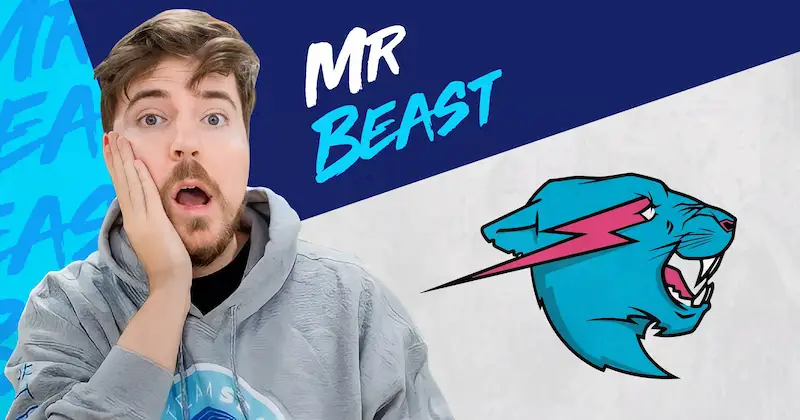
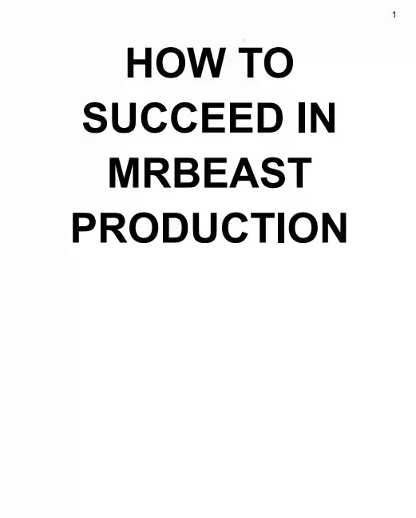
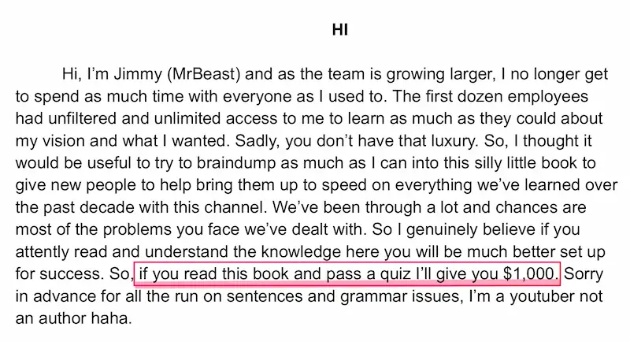
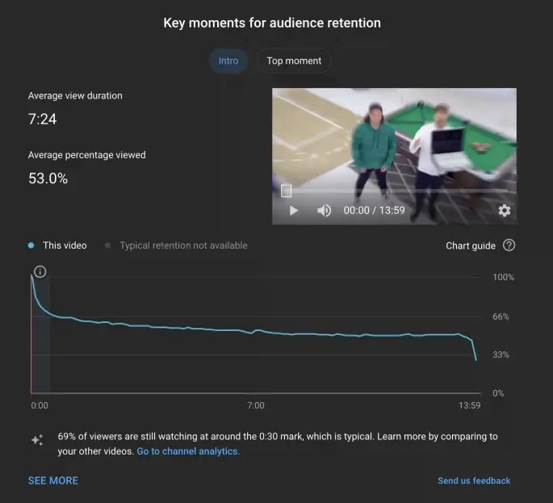

MrBeast 是美国第一网红，可能也是世界第一网红。他是 Youtube 订阅者最多的频道，2024年9月拥有3.17亿粉丝。

他每个视频的拍摄成本至少100万美元，制作团队有250人，可想而知，他的视频收益多么可观。

他们公司的员工培训手册（[下载地址](https://fermi.ink/uploads/2024/09/27/How-To-Succeed-At-MrBeast-Production.pdf)），最近流出了（下图）。

这是一个36页的 PDF 文件，是他本人写的，主要内容是告诉员工，如何在他的公司工作。

在第一页，MrBeast 要求员工熟读这本手册的每一句话，读完以后还要考试，通过者可以得到1000美元。

里面有很多 MrBeast 拍出爆款视频的经验总结，我觉得视频从业者必读，下面摘录几条。

（1）点击率 是最重要的指标，计算公式是点击视频封面缩略图的用户数量，除以看到缩略图的用户数量。

视频的标题（包括缩略图）决定了点击率，视频必须有一个吸引人的标题。

《我在家50个小时》是一个很蹩脚的标题，不会有人点击，改成《我吃了50个小时的番茄酱》，就会有点击。

然后，缩略图是一个人坐在满满一浴缸的番茄酱里面，就比一个人坐在前院，点击效果好得多。

一般来说，标题越极端越好，《我不喜欢香蕉》不如《香蕉是地球上最糟糕的食物》。

（2）观看时长 也很重要。Youtube 后台有详细图表，展示每个视频的观看时长百分比。

上图下方的曲线，就是视频在每个时点留存的观众百分比。可以看到，第一分钟最关键，留存的观众从100%快速下降到66%。

这就是说，三分之一的观众在第一分钟就放弃观看。上图的这个视频一共有6000万人次观看，但是在第一分钟我们就失去了2100万观众。

如果我们可以改善第一分钟，呈现更有趣的内容，可能就会少流失几百万人。第一分钟是每个视频最重要的一分钟。

（3）重新参与。视频的第1分钟告诉观众，他们会看到什么，然后从第1分钟到第3分钟开始疯狂推进故事。

假设有一个10分钟的视频，讲述一个人在树林里生存了几周。那么，前3分钟不要按部就班展示他每一天怎么过，而要让观众知道他已经生存了多日，唤起用户的情感和好奇心，想看看他能走多远。

这称为第三分钟重新参与，激发用户的兴趣，期待真正印象深刻的内容。

（4）视频的中段 是第3分钟到第6分钟，在这里可以规划所有最令人兴奋和有趣的内容，目标是让观众爱上这个故事、人物以及视频本身。

如果我们能让观众看完视频中段，他们就很有可能看到最后。通常在第六分钟，需要加入另一个非常有趣但需要更多解释的内容，让用户重新参与一次，将故事推动到后半部分。

（5）视频的后半段。一旦有人花了6分钟看这个视频，就表示对故事投入了极大的精力，很可能会坚持看到最后。

通常，不太有趣的内容会出现在视频的后半段，但是永远不要发出视频结束的信号，这样观众就不会关掉视频。

让观众坚持到最后的一个方法，就是保留悬念，比如看看谁能最后赢得10万美元，获胜者直到视频结束才揭晓。所以只要我们不让视频变得无聊得要死，人们很可能会坚持到最后。

另一个方法是阶梯式展示，比如《我买了世界上最大的烟花》这个视频一开始就展示了所有的烟花，然后点燃1美元的烟花，接着点燃10美元、50美元、75美元、1,000美元、10,000美元、40,000美元、100,000美元，最后点燃一个破世界纪录的烟花。

（6）总结。人们观看的时间越长，视频的效果就越好，这就是为什么我对每一秒都如此执着。

在视频开始时吸引观众，将内容变成一个令人惊叹的故事，让观众投入其中，没有沉闷的时刻，然后在视频结束时以突然的结局获得令人满意的回报。

!!!light 版权声明
本文作者：[Fermi](https://fermi.ink/about)
本文链接：[https://fermi.ink/posts/2024/09/27/01/](https://fermi.ink/posts/2024/09/27/01//.)
转载标题：【转载】如何拍出爆款视频 —— Fermi
许可说明：本站所有文章除特别声明外均为博主原创作品，遵循 [知识共享（CC BY-NC-SA 4.0）许可协议](http://creativecommons.org/licenses/by-nc-sa/4.0/ "BY-NC-SA")进行许可。非商业转载请注明原文出处（作者，原文链接）和本声明！商业转载请联系作者获得授权。
!!!