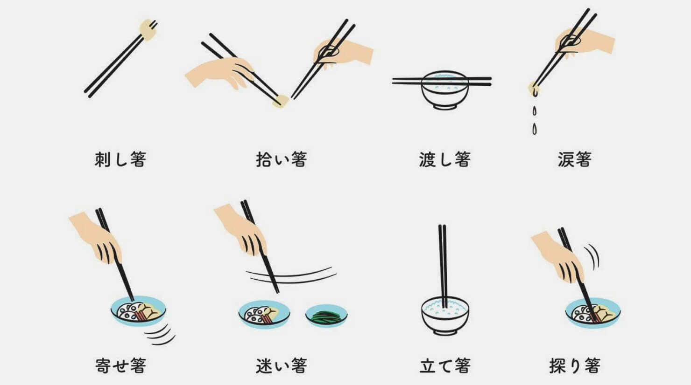

在日本用餐，筷子的使用不当不仅关乎个人礼貌，有时甚至会触碰深层的文化禁忌。这些被统称为“忌讳筷”的行为，在日语中写作kiraibashi。对于注重餐桌礼仪的人来说，掌握这些细节是尊重当地文化的第一步。

最严重的两个禁忌直接与日本的丧葬习俗挂钩。首先是“传递筷”，即两个人分别用筷子夹住同一块食物进行传递。在日本的火葬仪式后，亲属会用这种方式捡拾并传递亲人的遗骨，因此在餐桌上模仿这种动作被视为极大的不吉利。另一个是“立筷”，也就是将筷子垂直插在米饭中心。在佛教传统中，这是献给往生者的供奉方式，在日常生活中出现这种场景会让同桌的人感到非常不安。

除了这些涉及信仰的红线，还有一类行为反映了卫生习惯和对食物的尊重。比如“洗筷”，即在汤里涮洗筷子，或者“舔筷”，指用舌头舔舐筷尖上的残渣。很多人习惯在拿一次性木筷时用力摩擦以去除毛刺，这被称为“磨筷”。虽然这看起来是个实用的举动，但在精致的日料店里，这种行为暗示你认为店家提供的餐具质量低劣，显得不够体面。

在社交场合，筷子的动向也折射出一个人的性格修养。如果拿着筷子在不同的菜肴之间游移不定，被称为“迷惘筷”。如果夹起了一块菜却又原样放回去，则叫作“回头筷”。此外，用筷子指点他人或作为谈话时的手势，被称为“指人筷”，这在任何文化中都是非常粗鲁的举动。

餐桌上的几何布局也藏着学问。比如“桥筷”，指的是用餐中途将筷子像桥一样横跨在碗口，正确的做法应该是将其整齐地放在专门的筷托上。还有“拉盘筷”，即用筷子钩住远处的盘子边缘拉向自己，这种偷懒的行为被认为非常贪婪。甚至连表达感谢的方式也有讲究，在说“领受了”并合十致谢时，手里不应该握着筷子，否则就被称为“拜筷”。

甚至一些我们自认为聪明的“土办法”其实也是错误的。比如为了卫生而把筷子倒过来用尾端夹菜，这种“倒手筷”在正式礼仪中并不被推荐，因为尾端是手握的地方，其实并不干净。同样，把两根筷子并拢当成勺子去舀食物，或者把筷子当成叉子去扎取食物，也都属于失礼的范畴。

掌握这些细微的礼节，不仅仅是为了在餐桌上表现得像个地道的文化通，更是为了通过餐具的一举一动，表达出对厨师、食物以及同桌客人的敬意。根据2022年6月28日发布的资料显示，这些规矩虽然繁多，但其核心逻辑始终围绕着整洁、克制与对他人的体谅。