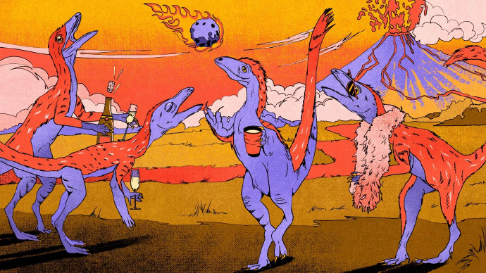

在那个命中注定的小行星撞击地球之前，"可怕的蜥蜴"们的生活是美好的。

  
当其他生物在三叠纪早期火热的冲击中灭亡时，像金刚龙这样的恐龙还在狂欢

我们都知道那颗小行星。大约在距今约6600万年前的北半球春天，一颗直径6英里的太空岩石撞击了地球，引发了地球上第五次大规模灭绝。几乎所有现存的植物和动物物种中有75%几乎一夜之间消失，我们心爱的恐龙也遭到了重创。在恐龙群体中，只有喙嘴鸟类幸存至今。

但我们一直过于关注恐龙时代的终结，而忽视了它们意外的崛起。大约在2.01亿年前，也就是侏罗纪时期的黎明时刻，另一次大规模灭绝使恐龙成为了我们所崇拜的"可怕的蜥蜴"。在古生物学家所认可的五次大规模灭绝中，第四次才真正奠定了舞台。

恐龙"统治"的概念如此普遍，以至于很难想象在遥远的过去，爬行动物并不是如此庞大且占主导地位的。然而，这正是古生物学家们发现的事实。我们目前所知的最古老的恐龙，来自距今2.3亿年前的三叠纪岩石中，它们相对较小、纤细，与古代景观中的其他动物相比非常罕见。例如，最近在津巴布韦发现的一种名为Mbiresaurus raathi的双足草食恐龙，大约和一只德国牧羊犬一样大小和重量，远远不是当时最大或最凶猛的生物。

三叠纪见证了不同的爬行动物家族的繁荣。该时期初期的一次大规模灭绝是由于现在的西伯利亚地区的大规模火山喷发引起的，这导致全球迅速变暖、大气氧气水平变化以及其他生态混乱，迫使这些有鳞片的生物以新的方式进化或灭绝。在此之后进化出的第一批恐龙是纤细的杂食动物，大约和一只拉布拉多犬一样大小。但对景观产生最大影响的爬行动物是今天鳄鱼的古老近亲，一群被称为伪鳄类的动物。

在过去的二十年中，古生物学家发现了多种伪鳄类，它们在恐龙出现之前就已经进化出了类似恐龙的解剖结构和行为。方头肉食动物Postosuchus看起来非常像霸王龙，最初被误认为是霸王龙的祖先，而实际上它是一只鳄鱼。小型草食动物Effigia okeefeae用两条腿奔跑，嘴巴里没有牙齿，类似于"鸵鸟模仿"恐龙，如Struthiomimus altus，这个物种在100多万年后才进化出来。厚甲壳的"犰狳鳄"Desmatosuchus也是伪鳄类，它们开创了一种后来由甲龙重新发明的多刺风格。三叠纪时期的史前鳄鱼形态各异，而恐龙大多数是小型、苗条，解剖结构并不引人注目。一些恐龙在该时期末期开始变得庞大，但它们与侏罗纪时期我们所见到的奇特恐龙相比，简直不值一提。

但到了20世纪50年代，古生物学家注意到他们发现的许多三叠纪动物群在接下来的侏罗纪早期已经消失了。大多数多样化的伪鳄类消失了，而恐龙似乎在三叠纪-侏罗纪界线上几乎毫发无损地存活下来。专家们提出了从海平面变化到早期小行星撞击再到解释生物多样性动荡的各种理论，尽管最有可能的罪魁祸首是在广阔的中大西洋岩浆省发生的另一次剧烈火山喷发。这些喷发发生在超大陆盘古大陆刚刚分裂的时候，但我们可以通过观察今天大陆拼图中保存的火山岩来了解受影响的地区。从新斯科舍到巴西，都发现了这次喷发的痕迹，持续了超过50万年，并将全球大气二氧化碳水平提高到比今天高10倍的水平。这还不是全部。地质学家还在这个关键时期的岩石中发现了二氧化硫的证据，这些化合物会在温室气体造成的暖期之间引起快速冷却。

为什么原始鳄鱼会消失，而恐龙却能轻松应对这些变化，这是一个谜。从理论上讲，你会认为一群进化出更多形状、大小和行为多样性的动物在压力下会表现得更好。虽然一些鳄鱼幸存了下来，但它们是追逐昆虫和蜥蜴的小型、相对普通的食肉动物，而不是大型、复杂的食肉动物。在大规模灭绝中，小型机会主义者往往能够找到足够的食物和栖息地，而更大、更专门化的动物则面临困境。但考虑到远古鳄鱼亲戚的命运，所有三个主要恐龙群体的成员都幸存下来，这似乎有些奇怪。

答案可能隐藏在比骨头更难保存的组织和生物系统中。2020年，古生物学家描述了恐龙和飞行翼龙的共同祖先的近亲，一种被他们命名为Kongonaphon kely的小型爬行动物。这种小动物会受益于它的温暖、蓬松的原始羽毛，这是恐龙和翼龙都具备的特征，古生物学家怀疑，小体型、温血和保温毛发是第一批恐龙所继承的特征。这些特征使它们能够适应更多样的栖息地，而不仅仅是它们的鳄鱼表亲。

根据去年分享的新研究，这个背景故事变得更加合理。早期恐龙的化石有时会出现在一年中至少有一部分时间被冰冻的栖息地中。虽然伪鳄类数量众多，但它们似乎只分布在较温暖的地区，而三叠纪恐龙的分布范围更广，使它们能够在2.01亿年前由火山喷发引起的气候变化中存活下来。

如果那些喷发没有发生，或者它们没有那么剧烈，那么"恐龙时代"可能会变成"鳄鱼时代"。恐龙的进化将受到与更广泛的伪鳄类互动的影响，创造出一个我们永远无法见到的另一个宇宙。两次大规模灭绝事件清除了生态环境，使恐龙能够进入适合繁衍和适应新形态的地方，这与它们自己数百万年后的灾难性时刻形成了鲜明的对比。