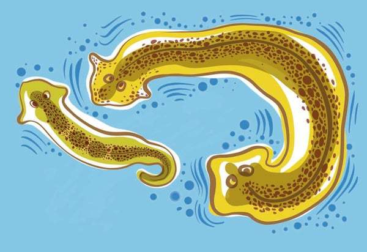

> 许多细胞团长期展现了基础认知能力，一些动物甚至失去了大脑还能记住事情

普通涡虫(Cestoda)的智识并不是我们眼中的佳话。这种逗号状的扁蠕虫，遍布全球湖泊的泥沼中。它那像针尖一样小的头部有个微小的结构称为大脑。它的两点眼睛一起看上去就像漫画里困惑的角色。它唯一的追求就是过着低劣的生命。

但这只蠕虫掌握了一个一直让人类智慧困惑的任务:完美的再生。把它撕成两半，头部能长出新的尾巴，尾巴也能长出新的头部。一星期之后，两只健康的蠕虫就这样游走了。

长出新头可是个神奇的能力。但是吸引塔夫茨大学生物学家迈克尔·列文的却是蠕虫的尾部。他研究的是生物体是怎样从单细胞发育起来的，他怀疑生物的智力在很大程度上并不在大脑中，可能就在蠕虫的后端的细胞中。“所有的智力其实都是集体智力，因为所有的认知系统都是由某种部件构成的，”列文说。一个可以经受头部全部丧失的动物就是列文的理想实验对象。

在自然状态下，涡虫更喜欢平滑、庇护的环境，而不是坎坷、开放的地方。把它们放在一个凹凸不平的容器里，它们会挤在边缘。但在大约十年前的实验室里，列文通过训练涡虫让它们期待食物——肝泥，他在一个凹凸不平的碟子中间滴下这种食物。很快它们不再害怕那条坎坷的路，信心满满地跨过那个难关去获取美食。他训练了几只在平滑碟子里的蠕虫。然后，他把它们全部斩首。

列文把头部扔掉，等了两周让尾部再生出新的头部。然后，他把再生的蠕虫放在凹凸不平的碟子中，然后在中间滴入肝泥。原来住在光滑盘子中的蠕虫很不愿意移动。但是，那些从住在凹凸盘中的尾巴再生出来的蠕虫学得更快就去觅食能源。无论如何，尽管完全丧失大脑，那些涡虫仍然保留了记起肝泥奖励的记忆。但这是怎么做到的?在哪里做的呢?

原来，普通细胞——不仅仅是高度专业化的大脑细胞比如神经元——有储存信息并依此行动的能力。现在，列文已经证明，细胞通过电场的微妙变化作为一种记忆方式。这些发现使这位生物学家走在了一个名为基础认知(basal cognition)新领域的前沿。该领域的研究者们发现了智力的标志——学习、记忆、解决问题——不仅存在于大脑中，也存在其外部。”

直到最近，大部分科学家都认为真正的认知能力随着大脑的出现在五亿年前而来。没有神经元的复杂群集，行为只是一种反射。但列文和其他研究者有着不同的看法。他并不否认大脑非常棒，尤其是它强大的计算速度和能力。但他把细胞团和大脑的区别看做是程度上的区别，而不是本质的区别。事实上，他怀疑， cognition可能就是对细胞开始合作完成建立复杂生物的非常困难的任务的逐渐进化，然后就变成了大脑，让动物移动和思考更快。

这种观点目前被各个领域的研究者们采纳，包括像何塞·邦加德这样的机器人学者，他是列文的合作者，也是弗蒙特大学形态、进化和认知实验室的负责人。邦加德说：“大脑是自然母亲最近发明出来的东西，是最后出现的。”他希望建立从底层构建的高智能机器。“显而易见，身体很重要，然后你在上面加上神经认知。这就像是在圣代上面的樱桃，而不是圣代。”

近年来，随着研究者们逐渐发现大脑并不是必要的，生命在诸多领域中都有嫣然独特的智力表现，对基础认知的兴趣激增。对于像邦加德这样的人工智能科学家来说，基础认知提供了一个摆脱未来智力必须复制以大脑为中心的人类模型的困境。对于医疗专家来说，唤起细胞自然的治愈和再生能力的可能性非常引人入胜。

对于喜欢思考的人来说，基础认知为世界投下了一道耀眼的新光。也许思考就是从简单开始的。也许思考每天都在我们周围发生，只是我们因为不知道如何寻找所以没有认出它。也许思想无处不在。

虽然现在这看来像个黑暗时代的想法，但就在几十年前，很多科学家都认为非人类动物不能感受到痛苦或其他情绪。真正的思考？不可能。思想是属于人类的领地。阿德莱德大学的帕梅拉·里昂(基础认知的研究者，2018年提出这个领域的名字)说：“这是最后的抵抗点。” 就像人类自认为是宇宙的中心，然后发现实际上并不是一样，里昂把科学家们对人类智力有质的区别的坚持看作是另一种必然失败的特例主义。“我们从每一个我们曾经谙熟的中心点都被拉了出来”，她指出。地球不是宇宙的中心。人类只是众多动物种类中的一种。真正的认知——也许会让我们与众不同。

现在，这个观点也在后退，因为研究者们记录下越来越多与我们日益疏远的动物丰富的内心生活的证据。猩猩、狗、海豚、乌鸦，甚至昆虫被证明比我们想象的聪明多了。行为生态学家拉尔斯·齐特卡在他2022年的书《蜜蜂的思维》中记录了他和蜜蜂数十年的工作，表明蜜蜂能使用手势语言，能认出人类的脸，能记住并传递远离花的位置。蜜蜂有好情绪和坏情绪，它们也能被如被一只躲在花里的机械蜘蛛抓住这样的临死经历所惊吓。(谁不会被吓到呢？)

当然，蜜蜂是有大脑的动物，所以有一点儿聪明也不会真的震撼到认知范式。更大的挑战则来自对我们没有大脑的亲属表现出的令人惊讶的复杂行为的证据。“神经元不是神奇的细胞”，佛罗伦萨大学的植物学家斯特凡诺·曼库索说，“神经元是一个能够产生电信号的正常细胞。在植物中，几乎每一个细胞都能做到这点。”

塔触我草(一种植物)的羽状叶片平时会在触摸时折叠和枯萎(防止被吃掉)，但当澳大利亚西部大学和意大利佛罗伦萨大学的一个科学家团队通过一整天的摇动让它习惯，并没有伤害它，它很快就学会忽视这种刺激。最令人惊讶的是，当科学家们让这个植物一个月不动，然后重新测试它时，它记住了之前的经历。其他植物还有其他能力。一个食虫捕蝇草能数数，只有当它的捕虫器上有两个感觉毛在很短的时间内被触动时，它才会闭合，并只有当它的感觉毛再被触动三次，它才会分泌消化液。

这些植物的反应都是由电信号调解的，就像动物一样。如果将一株食虫捕蝇草接到一株塔触我草上，只要一触动食虫捕蝇草的感觉毛，整株塔触我草就会垮掉。并且这些和其他植物面做麻醉气体昏迷。它们的电信号活动线就会平直，并停止响应，好像它们在睡觉。

植物对周围环境有出其不意的敏感度。它们知道自己是否被自己的其他部位或是别的东西遮蔽。它们能听到水流的声音(并会朝它生长)和蜜蜂翅膀的声音(并会分泌出花蜜)。它们知道自己是否被虫子吃掉，并会作出相应的烈性化学制品反应。当科学家们给一个水壶草播放一段小毛虫咀嚼的录音时，单单这个就足以让植物将芥末油送入叶子中。

植物最令人惊讶的行为通常被我们忽视，因为我们每天都能看到：它们总是似乎确切地知道自己的形状，并根据周围的光、声、气味规划自己的未来生长，对未来的资源和危险可能出现的地方做出决策，以一种不能被简单公式浓缩的方式。如西班牙穆尔西亚大学简易智力实验室所长、《智能植物》一书作者帕科·卡尔沃所言: “植物必须先生计划，以达成目标，而要做到这一点，它们需要整合大量的信息。它们需要主动适应各种条件，需要提前预测未来。否则，她们根本无法生存。

这并不意味着植物都是天才，但是在有限的工具包里，它们展示了对世界的感知以及用这些信息获取需要的东西的能力——这些都是智能的关键组成部分。但同样，植物是比较容易的案例——没有大脑，复杂性很多，有几万亿个细胞可供操作。这对于单细胞生物来说并不适用，后者通常被几乎所有人归类为“无脑”的类别。如果阿米巴都能思考，人类需要重新思考各种各样的假设。

然而天天都有表示单细胞藻类(食藻虫、无脊椎动物)开始思虑的证据出现。譬如考虑到粘菌(myxomycetes, 种类好像食藻虫或有寄生生活形式的真菌，能形成菌状体)，它是一堆细胞组成的黏糊糊的物质，看起来有点像熔化的贝尔维塔奶酪，全世界的森林里都有，它吃死掉的植物原料。虽然粘菌可能有一个摊上去就一平米大，但是粘菌实际上就是一个大单细胞，只有一个细胞，里面有很多细胞核。它没有神经系统，但是它解决问题的能力极好。当日本和匈牙利的研究者把一个粘菌放在一个迷宫的一端，而在另一个头放一堆燕麦，粘菌很快就发现了最短的路径。而且，当把粘菌放在日本列岛模型的东京位置，且在主要的城市放上奥特麦片时，它识别出了最佳的城市网络－－很像人类规划的公路。当然，粘菌不是想出解决方案，它只是尝试所有的可能性，然后去掉劣势的路径。

“它们的做法更接近自然选择的机制——非常简单且非常强大的问题解决工具，” 加州大学洛杉矶分校的认知心理学家、生物学家、哲学家和艺术史学家雅各布·依萨克·以色列森说。这种策略非常消耗能源和时间，但是粘菌有的是这两样。

当然，有些有细胞核的单细胞生物(把食古典希腊语中“proto-”(第一)和“-zoa”(动物)两个词语组合成协议来表示最早的、最原始的动物)有一个“感知器官”，它的功能几乎和大脑一样。比如说眼泪泡藻，它有单只“眼睛”(只有一个像素)和一个“胃口”。

眼泪泡藻可以分辨光线的亮度和方向，调整它的泳动，以便游向日光。能源可以证明任何生物的进化驱动器。当侦查了有一处淡水源，眼泪泡藻会源源不断游要的方向。而当它发现一次有耐忍小鸟火气藻就会赶紧逃跑。

当眼泪泡藻感觉遇到的游泳池有不好的浓度则会选择一个新的方向继续游弋，然后进而让多方向的选择，直到找到好的位置，消除了不良因素后或是化去了污秽气场之后才会安定下来。

这种问题解决方式可以被看作是简单的算法，但其他实验表明，黏菌可以学习。当法国国家科学研究中心的奥黛丽·杜苏图在一座铺满咖啡因(黏菌讨厌的东西)的桥的远端放了一盘燕麦片时，黏菌几天都无法找到过桥的办法，就像患有蜘蛛恐惧症的人试图绕过塔兰图拉蜘蛛一样。最终，它们饿极了，决定顶过咖啡因，大吃燕麦。很快，它们就对之前讨厌的咖啡因失去了厌恶感。他们克服了顾虑，从经验中学习，并在被置于悬停状态一年后仍保留了这种记忆。

这让我们回到了被斩首的涡虫。没有大脑的东西怎么记得任何事情呢？记忆是存在哪里的？它的意识在哪里？

记忆的正统观点是，它存储在一个稳定的网络中，这个网络由大脑中的神经元之间的突触连接组成。“这种观点显然已经开始崩裂了，”利文说。一些拆除工作来自加利福尼亚大学洛杉矶分校的神经科学家大卫·格兰兹曼的实验室。格兰兹曼能够通过从被电击的海蛞蝓大脑中提取RNA，并将其注入新海蛞蝓的大脑，将一种电击的记忆从一个海蛞蝓转移到另一个海蛞蝓。然后，接受者就“记住了”要回避触摸之前的电击。如果RNA可以作为记忆存储的介质，任何细胞可能都有这种能力，而不仅仅是神经元。

实际上，细胞群能够整合经验的可能机制层出不穷。所有的细胞在他们的细胞骨架和基因调控网络中都有许多可调节的部分，可以被设置成不同的构象，并可以在后来影响行为。在被斩首的涡虫的案例中，科学家们还不确定，但也许剩下的身体将信息储存在细胞内部，这些信息可以在身体重建时传达给身体其余部分。也许他们神经的基本反应已经被粗糙的地面改变了。

尽管利文认为，发生了更有趣的事情：也许记忆是储存在细胞之间通过生电的交互状态中，而不仅仅是在细胞内部。生电是所有生物体内流动的微弱电流。利文在他的职业生涯中花了大量的时间研究细胞集合体如何在形成过程中，或者说构建身体过程中解决复杂问题。他们是如何协同工作在正确的位置上造出肢体和器官的呢？答案的一部分似乎在生电中。

几个世纪以来，人们已经知道身体中有电在闪烁，但直到最近，大多数生物学家都认为它主要是用来传递信号的。通过青蛙的神经系统传输一些电流，青蛙的腿就会踹。神经元用生电来传递信息，但大多数科学家认为这是大脑的专业，而不是身体的。

然而，自1930年代以来，少数研究者观察到其他类型的细胞似乎正在用生物电存储和分享他们观察到的信息。利文投身于这个非传统的研究领域，并做出了下一个认知的飞跃，他借鉴了他在计算机科学的背景。他在学校时通过编写代码为自己赚钱，他知道电脑用电力来切换他们的晶体管的开关，把它们从0变成1，所有的电脑程序都是用这种基础建立起来的。所以作为一个本科生，当他了解到身体的所有细胞在他们的膜中都有类似电压门的通道，允许不同的电级通过时，他立刻意识到这种门可以像晶体管一样起作用，细胞可以利用这种以电驱动的信息处理来协调他们的活动。

为了找出电压变化是否真的改变了细胞之间传递信息的方式，利文转向他的涡虫农场。在2000年代，他设计了一种可以在涡虫任何一个点上测量电压的方法，并发现头和尾部的电压是不同的。当他用药物把尾部的电压改变成通常在头部发现的电压时，粘虫没有被打乱。但然后他把涡虫切成两半，头部重新长出了一个头，而非尾巴。显著的是，当利文把这个新的涡虫切成两半时，两个头部都长出了新的头。尽管这些涡虫在基因上和正常的涡虫完全相同，这种一次性的电压改变导致了一个永久的双头状态。

为了找出电压的变化是否真的改变了细胞之间的信息传递方式，列文重归他的涡虫农场。在2000年代，他设计出一种能在涡虫体上任何点测量电压的方法，并在头和尾部找到了不同的电压。当他用药物把尾部的电压改变到通常在头部发现的电压时，虫子并不受影响。但是，当他把涡虫一分为二时，头部重生出了第二个头，而不是尾巴。值得注意的是，当列文把这个新的涡虫切成两半时，两个头部都长出了新头。虽然这些虫子在基因上与正常的涡虫完全相同，但这一次的电压改变导致了一个永久的双头状态。

为了进一步确认生物电能控制身体的形状和生长，列文研究了非洲爪蟾，这是一种常见的实验动物，它们能快速从卵变成蝌蚪再变成成体。他发现，他可以在任何一个位置引发一种特定的电压，从而触发一只工作正常的眼睛的产生。仅仅通过在伤口上施加正确电压的方式24小时，他能诱导出一条功能正常的腿的再生。细胞就这样自己完成了。

列文说：“这就像一个子程序调用。” 在计算机编程中，子程序调用是一段代码，一种速记符号，告诉机器启动一整套低级机械动作。这种高级编程的美在于，它让我们可以控制数十亿的电路，而不需要打开机器，手动改变每一个。这和构建蝌蚪眼睛的情况类似。没有人需要逐步管理镜片，视网膜和所有其他眼部的构建。所有这些都可以在生物电的层次上控制。“这就是认知的胶水，”列文说，“这是让细胞群体能一起工作的东西。”

列文认为，这个发现不仅对我们理解认知的演化有深远的影响，而且对人类医学也有重要的意义。学习“说细胞”——通过生物电调整细胞的行为——可能会帮助我们治疗癌症，这是一种当身体的一部分不再与其他部分合作时引发的疾病。正常的细胞被编程成为整体的一部分，负责执行给定的任务——如肝脏细胞，皮肤细胞等等。但是，癌症细胞会停止它们的工作，并开始把周围的身体看作是一个陌生的环境，自谋生路寻求营养、复制和保护自身不受伤害。换句话说，他们行事像独立的生物。

他们为什么会失去群体的身份呢？ 一部分原因，列文说，是因为维持细胞思维融合的机制可能会出现问题。“压力、化学品、基因突变都会导致这种沟通的崩溃，”他说。他的团队只是通过在健康的组织上强制一个“不良”的生物电模式，就能刺激大败到引发腓腿部的肿瘤。就像癌症细胞停止接收它们的命令并变得不受控制一样。

更为激动人心的是，列文已经通过重新引入正确的生物电模式——实际上重新建立了范围内癌症和身体的通信，好像他正在把卧底细胞带回正规人道中。他推测，未来的某一时刻，生物电疗法可能被应用到人类的癌症中，使肿瘤停止生长。如果科学家们能够破解告诉细胞以正确的模式开始生长的生物电密码，它也可能在生殖器官衰退的情况下起作用——比如肾脏或心脏。实际上，列文在蝌蚪上展示了，一种动物即便在出生时受到大脑严重损伤，也能在正确的生物电刺激后构建正常的大脑。

列文的研究总是有些具体的应用，比如癌症治疗，肢体再生和伤口愈合。但在过去的几年里，他的论文和讲座中引入了一种哲学的思考。“这是一种缓慢的推出，”他承认，“我有这些想法已经有几十年了，但那时不是谈论这些的正确时机。”

这一切在他的一篇题为《自我的计算边界》的著名文章中开始发生变化，他在这篇文章中利用他的实验结果来论证我们所有人都是由更小的、具有高度解决问题能力的代理人构建出来的集体智能。正如佛蒙特州的邦加德对纽约时报所说：“我们是由智能机器组成的智能机器，由智能机器组成，一直到底。”

对于列文来说，这种认识部分来自于他观察非洲爪蟾的身体发育过程。在蛙从蝌蚪变为成体的过程中，他们的脸部经历了巨大的重组。头部改变了形状，眼睛、嘴巴和鼻孔都迁移到了新位置。常见的假设一直是这些重排是硬编码的，并遵循基因控制的简单机械算法，但列文怀疑这并非如此确定。所以他电击了正常发育的青蛙胚胎，创造出眼睛、鼻孔和嘴巴在所有错误地方的蝌蚪。列文将它们称为“毕加索蝌蚪”，他们真的像毕加索的作品。

如果重塑是预设的，最后的青蛙脸应该和蝌蚪的一样混乱。在青蛙的演化历史中，没有任何东西给了它如何处理这种新情况的基因。但列文惊奇地看着蝌蚪在变成青蛙的过程中，眼睛和嘴巴找到了正确的排列位置。细胞拥有一种抽象的目标，并共同努力达成它。列文写道：“这是智能在行动，面对变化的环境采取新步骤以达成特定目标或解决问题的能力。” 通过生物电融入一种共享的思维，细胞实现了超越我们最优秀的基因操纵工程师的生物工程壮举。

列文的工作引起了人工智能和机器人领域的强烈关注，他们在基础认知中看到了解决一些核心弱点的途径。尽管他们在处理语言或玩有明确定义规则的游戏方面具有惊人的优势，但人工智能在理解物理世界上还是非常困难。他们可以在莎士比亚的风格下生成十四行诗，但让他们如何走路或预测一个球如何滚下山，他们就懵了。

据邦加德说，这是因为这些人工智能在某种程度上，太过头脑天马。他说：“如果你和这些AI玩耍，你会开始看到其中的裂缝。他们倾向于像常识和因果关系的东西，这就指向了为什么你需要一个身体。如果你有一个身体，你就可以通过你所导致的影响来了解因果关系。但这些AI系统不能通过戳一戳来了解世界。”

邦加德是“有形思维”运动的先锋，该运动试图设计出可以通过监控其形式与环境交互方式来了解世界的机器人。他说，要看到有形思维的实例，不妨看看他1岁半的孩子，“他可能就在这时候毁掉了厨房。这就是幼崽所做的。他们戳戳世界，从字面上和比喻上看，然后看看世界如何反击。这是无情的。”

邦加德的实验室使用AI程序来设计由柔性、LEGO样的方块构成的机器人，他称之为“机器人的Minecraft”。这些方块就像块状的肌肉，让机器人们可以像毛毛虫那样移动他们的身体。由AI设计的机器人通过试错学习，增加和减少方块，随着最差的设计被淘汰，他们“进化”成更具活动性的形态。

在2020年，邦加德的AI发现了如何让机器人行走。那个实现启发了列文的实验室使用显微手术从非洲爪蟾上取下活的皮肤干细胞，并在水中稍微放在一起。这些细胞融合成一颗芝麻大小的肿块，作为一个单位行动。皮肤细胞有纤毛，这些微小的毛发通常在成年的爪蟾的表层上保持一层保护性的粘液，但这些新构建体用它们的纤毛像划桨一样，来摇橹穿过他们的新世界。他们通过迷宫，甚至在受伤时能够修复伤口。从他们的局部生物学中获得了解放，它们变得新奇，并充分利用了他们的环境。尽管他们的基因组与青蛙相同，但他们绝对不是青蛙。虽然这些细胞原来来自非洲爪蟾的一个属，列文和邦加德把他们称为“异生物”。在2023年，他们展示了可以通过一种其他物种的部分：人类肺细胞来实现类似的壮举。人体细胞的团块自我组装并以特定的方式移动。塔夫茨团队给它们命名为“人行者”。

对列文来说，异生物和人行者是我们需要重新思考实际世界中认知是如何发挥作用的另一个迹象。“通常，当你问一个活着的事物，你会问，‘为什么它有它所拥有的形状，为什么它有它所拥有的行为？’而标准的答案是演化，当然是演化。它是经过亿万年的选择后的结果。好吧，你猜怎么着？从来没有过任何异生物。对做好异生物从来没有任何压力。那么，这些东西在找到自己的世界后的24小时内，为什么会做这样的事情呢？我认为这是因为进化并没有产生对特定问题的具体解决方案。它产生的是解决问题的机器。”

异生物和人行者当然在他们的能力上有很大的限制，但他们或许提供了一个窗口来看当具有某种目标和需求的个体单位聚集到一起来合作时，智能如何可能自然地扩展开来。列文认为这种内在的创新倾向是演化推动的一种基本力量，推动世界向着查尔斯·达尔文所说的“最美丽的无尽形式”的状态。他说：“我们还没有很好的词汇描述，但我真诚地相信，所有这些的未来要看起来更像是精神病学的谈话，而不是化学的谈话。我们将最终拥有关于压力、记忆和吸引力的演算。”

列文希望这种视角可以帮助我们克服我们承认那些与我们自己的包裹形式相去甚远的思维的困境，无论它们是由黏泥或硅制成。阿德莱德的莱昂认为，意识到这种亲缘关系是基础认知的真正承诺。她说：“我们认为我们是创造的王冠。但是如果我们开始意识到，我们与草叶和我们肚子里的细菌有着很多的共同之处——我们在真的，真的意义上和这个世界是一个——可能这会让我们更加珍视这个世界。”
