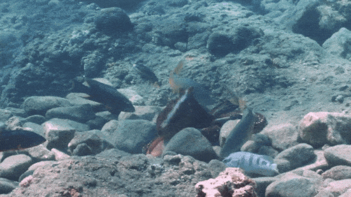

什么东西八条腿，会在鱼群里捕食，还能打出犀利的一拳？

根据上周发表在《生态学》期刊上的一篇研究文张，这个问题的答案是章鱼。

章鱼会猛打鱼类。而且还是存心的。有时候殴打鱼是事出有因的，但也有时候是毫无缘由的。研究人员也用视频记录下来了章鱼的这一行为。

研究人员Eduardo Sampaio第一次目睹这种现象时笑出了声。放平时到没有什么，但当时他正穿着水肺在水下作业。

“第一次见到它打鱼的时候，我扑哧一下就乐了，”他在一次采访中说道，“差点被潜水调节器给呛死。”

章鱼通常是一种独居生物，但有时它们也会参加鱼群组成的捕猎派对。比如说，石斑鱼的姿势能够为章鱼提供猎物所在之处的线索。Sampaio和同事当时在研究这种互利行为，然后遇见了一条正在捕猎的章鱼朝着一条鱼胖揍了一拳。

虽然此前有研究人员见识过章鱼揍鱼，但在捕猎派对中出现这种行为还是新鲜事儿。Sampaio说，而且这打的毫无预兆，特别突然。

“你能看出来有些出拳几乎就是小打小闹，”Sampaio说，“但还有一些是先把腕足卷起来，然后再伸展开，就像是拳击手出拳那样。”

他说，这些“拳击”相当罕见，所以想要目睹一次很难。该研究也随之产生了许多问题，像是“有什么鱼是章鱼更爱揍的吗？”

在一些情况中，研究人员能够分辨这种水下霸凌的原由。

他说，有时这就是一种同伴控制机制，章鱼想把鱼赶走，不要和自己抢下顿饭。或者是想去控制鱼游进的方向。或者是一种惩罚措施。

而有时这种八条腿的生物出拳揍鱼并没有什么明显动机。