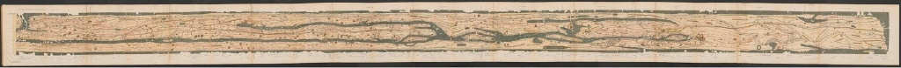

这个地图故事讲的是关于一张特殊的地图，这是罗马帝国的唯一遗留地图。这张地图长6.8米，高33厘米，跨度从今日的西法到斯里兰卡，从南部的阿斯旺到北部的海牙，几乎包括了已知世界的所有地方。它显示的是公共课程的路线，这是国家管理的供信使和官方运输使用的道路网。我们称之为Tabula Peutingeriana。

  
_19世纪Peutinger地图副本的摹本_

它的名字来自16世纪的收藏家康拉德·佩京，他拥有的中世纪幸存下来的这份地图只有一份；它是在1200年代制作的，由11个独立羊皮纸面板组成。很有可能是还有第12张面板显示了帝国最西部的部分，包括英国，伊比利亚半岛和摩洛哥，但它没有保存到现在。

## 公路的旅行

公路课程是由奥古斯都皇帝在公元前27年到公元14年发起的，作为一个快速、安全的政府和军事通讯和官方旅行服务。车站是在公路的间隔处设立的，在路过一天的旅行间隔都会设置车站，所有车站都提供设施修车，更换马匹(或骡子，或驴子)并供夜间休息。有些还提供额外的便利设施，如温泉，豪华的住宿，寺庙或卫城。奥古斯都因此引入了一个系统，可以使一名邮差将每个包裹或消息都送到目的地，而不是像之前那样由一个人向另一个人转送。

  
_一幅15世纪的地图，以托勒密的投影为基础，托勒密于公元150年左右在亚历山大出版了这幅地图。像托勒密这样的古典地理学家可以绘制出精确的、基于坐标的《Tabula Peutingeriana》所示地区的地图。_

道路上有交通，也有信使，但不是每个人都可以随意进入；旅行者必须携带政府或军方发放的许可证，注明他们的姓名，旅行日期，预定的路线和住宿位置。伪造许可证并不少见。

## 仔细看看Tabula Peutingeriana

乍一看，这张地图上很难识别出欧洲的形状。为了适应面板的格式，地理位置被大量拉伸和扭曲：比如，意大利半岛,占了整个地图的三分之一，并且被旋转使其长度看起来是从东到西，而不是从北到南。自然地理的一些元素，如水域，森林和河流都在地图上，但都变形了很多。这并不是因为古人不知道现实世界是什么样子——托勒密世界地图在那个时候是众所周知的，地图学是被认可的科学领域。

但如果你只是关注红色画出的道路，那么他们的通向何处以及各个城市是如何连接的就变得很清晰了。换句话说，图普特，尔京格利亚纳看上去像是一张现代地图——一张现代交通图。

## 交通地图的数学

一张公共交通地图通常不会在地理上正确；它只显示了您需要从站台A到站台B的信息。其他任何信息——比如规模、距离、站点的确切位置，以及除交通线路外的城市的其他特征——都被剥离，以使乘客尽可能地找到他们的路线。最抽象的交通地图，只显示线路和站点，可以被描述为数学图。

图是数学对象，在图中某些点，或顶点，通过线，或边，进行连接。图的性质由顶点的数目和边连接它们的特定方式决定。其他所有关于它的东西——我们把顶点放在哪，边有多长，它们是直的，还是弯曲的，或者是环形的——在数学上来说，是无关紧要的。

  
_所有这些图都表示同一幅图--一条“火车线”直接连接三个“车站”_

实际上，地图从一开始就是图论的一部分，自从伦纳德·欧拉在18世纪晚期，引入它作为一个数学领域。在他关于哥尼斯堡七座桥的论文中，他证明这个城市，四个陆地被七座桥连接，是不可能在不重复过桥的情况下，通过所有七座桥。欧拉做的是删除了除陆地和桥梁之外的所有地形特征，并将陆地视为顶点，桥梁作为连接它们的边。因为这种图保留了所有重要的信息，关于如何从一个陆地到另一个陆地的(就像一张交通地图！)，他可以用它作为在他的证明中的城市的简单表示。

  
欧拉的哥尼斯堡地图，显示了哥尼斯堡的四块陆地和七座桥梁，以及表示同一区域的图形。每个顶点代表一块陆地，连接它们的每条边代表一座桥梁。

现代交通地图和Tabula Peutingeriana都不是地图——它们都是图的可视化。邮差站是图的顶点，连接两个站的每一段路都是个边。(事实上，Tabula是一个拉丁语术语，也可以表示图，图表，或者图形)

就像在现代交通图中一样，有很多道路的区域可以被放大或者扭曲以更清楚地显示网络。这种“扭曲”的视角使得显示最重要的信息更为容易：哪条路线通往你的目的地以及它经过的站点。

  
_显示意大利半岛南部和西西里岛的Tabula剖面图。虽然地理位置被扭曲了，但城市之间的道路连接却很清晰。_

  
_同一地区的Cursus Publicus地图_

## 阅读并使用Tabula Peutingeriana

地图上标记了555个城市和3500个其他驿站。每个停车点都被符号标记，显示提供的设施，包括神庙，港口，公共浴室，和防御城墙。最重要的城市——罗马、君士坦丁堡和安条克——被标记了更多的装饰性符号。

  
_罗马、君士坦丁堡和安提阿_

学者认为，罗马帝国的旅行者其实并不会在路上携带他们的地图。他们可能会在复制的时候不方便，而且携带一张七米长的地图听起来非常不切实际。相反，旅行者会携带行程——一个书面的目的地列表，以及它们和其他附近城市的连接和距离。这些将会更便宜产出，所以旅行者很容易拿到他们前往方向所需要的行程。

那么地图什么时候会被用到呢？因为没有古典文献提到Tabula Peutingeriana，或者任何其他道路地图，所以很难精确地知道。可能是用来提前规划更长的旅行，或者为了政治和军事策划目的。

这张地图含有一些看似没实际用处的信息。比如，印度上方有句注解：“在这里，象被生出”。地图上还标注了亚历山大大帝的帝国最远的边境(现在的塔吉克斯坦)，注释是：“在此，亚历山大得到回答：亚历山大，你能到达何处？”有些研究者认为，这张地图不只是导航工具，还展示了罗马帝国的力量。道路比被征服的城市更重要，没有道路，就无法传讯息，调动军队，运输食物和贸易物品，也就无法将帝国整体保持在一起。

## 地图的新生

地图的第一版没有确定的时间。它一定被复制过很多次，但现存的只有一份，大约在罗马帝国倒塌后的700年左右(即1200年)制作的。每次地图被复制，描绘地图的人都有机会添加自己的内容和出现错误。结果就是，地图混合了不同的世纪，呈现了一个从未在任何一个时间点真实存在过的现实。

例如，虽然庞贝城在79年的火山喷发后被废弃，但它在地图上被标记了出来。而地图上写的是“君士坦丁堡”而不是“拜占庭”(公元500年前的通称)，“耶路撒冷”而不是“艾里亚卡皮托里娜”(公元135-324年罗马人的称呼)。有时候，因为同一座城市在不同的历史名字下出现了多次，道路甚至会被重复出现。明显的是，有些添加内容是由基督教抄写员完成的，比如在西奈沙漠的地方写上了：“在西奈山，他们接收了法律”。

关于地图自创作之日至现存复制品诞生期间的走向，没有任何信息。1494年，这份复制品在虫的图书馆被重新发现。德国文艺复兴时期的学者和诗人康拉德·切尔特斯可能从那里偷走了它。切尔特斯去世前，把地图送给了他的好朋友康拉德·普图林格，普图林格一家为它命名并保存了200年。在神圣罗马帝国的贵族家庭中，链接他们的帝国和古罗马的文物具有特殊意义。普图林格一家在1714年卖掉了地图，最终在1737年被哈布斯堡帝国法院图书馆买下，现在保存在维也纳的奥地利国家图书馆。