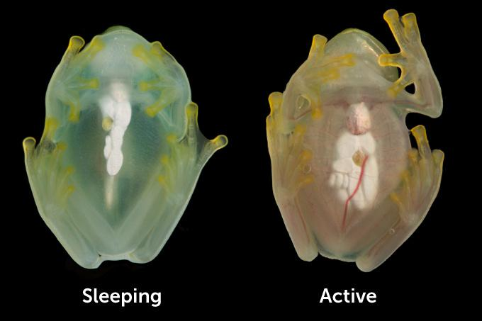

这种蛙 (Hyalinobatrachium fleischmanni) 能把血细胞藏起来从而提高自身透明度，而且这样做也没有副作用。

一项新的研究指出：当这些小小的玻璃蛙入睡时，它们会把自身百分之九十的血红细胞从循环系统中移出。玻璃蛙的肝脏有着镜面一样的表皮，而大部分血红细胞都被藏在了肝脏里的一个囊中。生物学家之前就知道玻璃蛙有着透光的身体，但是这次的发现(暂时隐藏大部分血细胞)给关于脊椎动物迷彩能力的研究带来了新的血液。

发现者之一、进化学方向的生物化学学家Carlos Taboada(工作于杜克大学)说：“它们的心脏里流动的不再是正常的红色血液，而是一种偏蓝色的液体。”

另一名发现者Jesse Delia (工作于纽约市的美国自然历史博物馆)说：“人类有可能经受循环系统的阻塞，但是这些玻璃蛙把几乎所有的血细胞都打包在了一起，几个小时内也没有产生血栓。当玻璃蛙醒来后，这些血细胞就自行解散，并且开始循环起来。”

Taboada，Delia和其他合作者在《科学》杂志上发表的文章中指出：把这些血细胞藏起来可以把玻璃蛙的透明度提高二到三倍。这些玻璃蛙在一天中的大部分时间都躲在高高的树冠中某片树叶的背阴面，而泛绿色的透明状对它们的隐藏起到了很大的帮助。

  
*睡眠中的玻璃蛙通过把大部分血细胞储存在肝脏中来隐藏自己*  

当一只玻璃蛙醒来，开始活动的时候，藏在肝脏里的血液就会重新流动起来，让这只玻璃蛙变得更加透明。

Delia观察到玻璃蛙的透明状起源于一次紧急的拍摄任务。他之前一直在研究玻璃蛙的行为，但是从来没有观察它们睡觉时的状态。“过去几年里，当它们睡觉时，我就也去睡觉了。”直到一天他为了赶紧拍几张玻璃蛙的特写，他才终于看到了它们睡觉的样子。

Delia说：我真的看到不到任何血红色。我当时拍了个视频，真的很神奇。”

当Delia向杜克大学的一个实验室寻求合作的时候，他惊讶地发现另一名科研人员也正在向这个实验室寻求合作来研究玻璃蛙的透明态。Delia当时觉得那真是糟了。但是杜克大学生物光学实验室的领头人，Sönke Johnsen，说Delia和他的竞争者Taboada有着不同的技能点，所以他们应该合作来研究这个项目。Delia说：“我一开始以为我俩会是死对头，但是现在我几乎把他当亲人了。”

然而在活青蛙体内研究血红细胞的行为是一件很困难的事：光学显微镜并不能穿透玻璃蛙那种带有镜面状表皮的肝脏；在实验过程中也不能把玻璃蛙唤醒，否则血红细胞就会流回体内；麻醉会使得玻璃蛙的肝脏暂时停止工作。

Delia和Taboada最终利用了工程学中经常用到的光声成像法(photoacoustic imaging  
)。这种方法可以揭示内脏器官：当激光照射内脏时，一部分能量被照射部分吸收从而转化成热能，这部分能量会引起被照射部分膨胀而产生超声波。由于不同成分对于光能的吸收水平不同，激发出的超声波的强度也随之变化，从而可以反推出被观测的内脏的内部成分。杜克大学的Junjie Yao负责利用这项技术来观察玻璃蛙的肝脏，同时保证在观察过程中不把它们吵醒。

尽管玻璃蛙的透明态小有名气，但是在脊椎动物界中有着更极端的例子。研究鱼类的生物学家Sarah Friedman(工作在位于西雅图的国家海洋与大气管理局的阿拉斯加渔业科学中心、未参与此项研究)曾于七月份在推特上发布了一张刚抓到的斑点鱼。那条鱼身体大部分都是透明的，甚至能直接看到鱼骨。这也不是最棒的例子。处在幼鱼阶段的海鲢，鳗鱼，草鱼，还有某种亚洲的鲇鱼“几乎是完全透明的”，Frideman说。“不过这些例子都是生活在水中的。”当动物的身体和周围的水环境并没有太大视觉上的差别时，进化出顶级的玻璃态(透明态)相对比较简单。但是不管在陆地上还是水里，能够有个透明的身体还是很酷的。