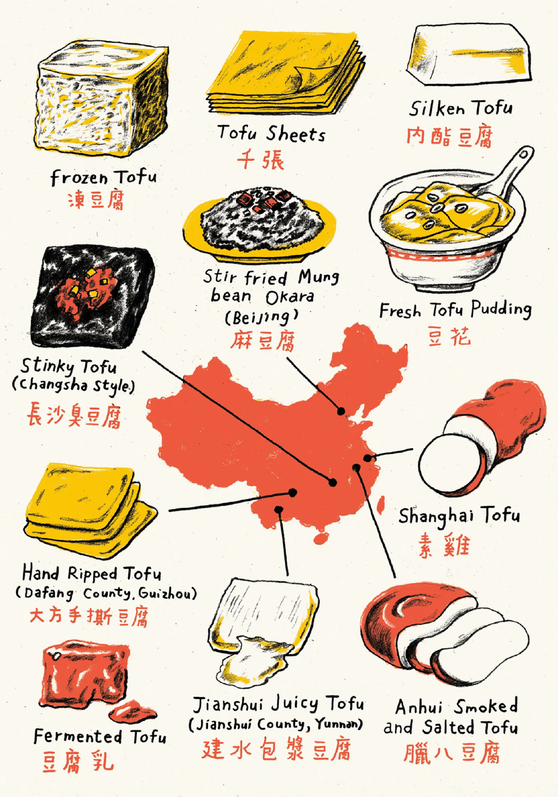

中国已经花了几千年的时间探索大豆凝乳的烹饪可能性。西方却仅仅触及其表面。

贵阳并没有那么多餐馆，这座大都市更像是一个城市规模的夜市。即使在新冠疫情前，像青云路这样的街道只有一半被车辆所占据，给商业帐篷和桌椅留出了空间，一直延伸到视线所及的地平线。还给那升腾到云端的烟和蒸汽留出了空间。餐馆并没有般负担你14页的菜单，这在上海或东北餐馆是常见的。不，一个烙锅店只卖烙锅(用更多的蔬菜过一个陶罐顶部的韩国烧烤)。一个丝娃娃店只卖丝娃娃(20多种新鲜的和腌制的蔬菜碎片，你可以把它们卷进一个薄薄的，类似米饼的塔可)。豆腐摊只卖豆腐。但可能不是你所想象的那种豆腐。

苍白的豆腐块在咕噜咕噜的钢烤箱上抖动。当它们的顶部在凉爽的夏夜空气中沐浴时，它们的底部开始紧缩并变色。当阿姨翻过一块豆腐时，豆腐的底部呈紫色，像一个淤眼，厚厚的皮肤像煎蛋黄，有蜡质般的温和和微裂纹。然后它开始膨胀。

豆腐开始膨胀起来，像一锅不能煮沸的水一样痉挛。一两分钟内，豆腐一直在膨胀，膨胀，直到豆腐的体积增加到原来的两倍。最后，一道热蒸汽渗过紧绷的皮肤。流出了一股慢慢的，奶白色的液体。

阿姨在豆腐的一端挖了个小孔，用勺子加入了她的招牌酱汁：烤辣椒碎，酱油，姜，薄荷，和一种因其草香和鱼腥香而被珍视的药用根——鱼腥草。她递过了她的创作：恋爱豆腐果。这是爱情豆腐水饺。

我咬了一口。流出来的是一种稠厚的，带有硫磺味的液体，既丰厚如蛋黄糕，又清新如新鲜的豆浆。硬豆腐牺牲了自己，融化成了汁水。我的舌头无法相信这就是豆腐。

在大学里我尝试成为素食者，放弃了我大部分喜欢的食物，这让我很痛苦。但在中国度过了一个夏天后，一切都改变了。我现在在这里的借口是“出国留学”，但真正的目的是穿越全国，寻找能让我和洛杉矶的其他素食者兴奋的食物。我得了解一下这个恋爱豆腐果。

!!!light @掩面而逃 #11915775
冻豆腐:冻豆腐  
千张:薄页豆腐  
内酯豆腐:丝滑豆腐  
长沙臭豆腐:很臭的豆腐  
麻豆腐:炒绿豆拌豆渣  
豆花:新鲜的豆腐布丁  
大方手撕豆腐:手撕豆腐  
素鸡:上海豆腐  
豆腐乳:发酵豆腐  
建水包浆豆腐:建水汁豆腐  
腊八豆腐:安徽烟熏咸豆腐
!!!

贵阳的街头豆腐摊商是中国素食烹饪古老历史的一部分。最古老和最知名的流派是佛道寺庙的素食，或者叫斋菜。这两种传统都鼓励不杀生，甚至不渴望动物的肉体，而是通过世纪的熏陶，将植物培育成了能够满足人们味蕾的无肉餐。素斋有许多特色。比如，蒜类因其春药性质而被禁止使用。芫荽种子本来是为了区别中国佛教徒和喜马拉雅山对面的印度教徒，也被禁止。正如通常情况下，一个区域的限制性会导致另一个区域的创新，为了更密切的关系，人们选择了菌菇和香椿等草本植物。信徒没有通过抗议或付费广告进行宣传；他们开设餐厅，从上海和北京的米其林星级餐馆到东南亚无处不在的3美元自助餐。

朴素的寺庙食物与中国皇帝的豪华盛宴，或者说宫廷素食，相去甚远。清朝的康熙皇帝是一位虔诚的佛教徒，他命令大批厨师用植物复刻肉类的味道和质地：用竹子做猪排骨；用腌制、卷起的豆腐皮做鹅肉；用土豆和胡萝卜做蟹肉。随着时间的推移，这些食物已经融入了更主流的江苏和浙江菜系，成为上海周边数千万人的日常食物。像上海著名的功德林这样的餐馆，为客人们提供了一次品鉴历史的旅程，让他们有机会体验一下皇帝的饮食习惯。

虽然寺庙和宮廷素食主义更为突出，但中国最后一种以植物为基础的菜系却更为普遍。它不是道德、宗教或者有意识的，而是经济的。历史上，肉类是很昂贵的。因此，默认的饮食方式总是民间素食。然而，由于这种菜系如此分散，所以很难将其具象化。在中国，各种各样的素食的多样性难以用言语来形容。去唐人街是体验不到这些的。这些食物是中国穷人的食物，那些无法离开家乡的人。

然而，这些移民是这些食物在国际舞台上的保护者，虽然他们的贡献可能被忽视，甚至在他们本国都有可能被忽视。正如在其他很多国家一样，当中国人迁移到城市或者移民到其他国家时，他们带来了这些菜肴，并将其规范化。在广东，对海鲜的欣赏最终演变为“广式素食”，这种食物模仿了海洋生物的观音菜和素鲍鱼。在台湾，一种素食运动浮现，名为“健康素食”，它不仅模仿肉类，甚至超越了肉类，创造了像素烤肉饭、素炸鸡和素鸭舌等菜。在现代生活中，周六可能会在合家蔬菜咖喱和自制的香菜面包旁边发现炒饭和素火腿。

当我在贵阳的豆腐摊旁站定时，我努力想象能否在美国的大城市街头看到这种独特的豆腐烹饪方式。美国有全素食的比萨店、全素食的汉堡店，和全素食的日本拉面店，但豆腐有那么多种烹饪方式却没有得到展示。

在中国的城市和农村，豆腐是一种常见的食物。但在西方，豆腐被当做面无表情的、碰了就坏的物品看待，好像触摸它可能会感染上乳房癌和大豆过敏或男性乳房增大。

豆腐工厂的工人把这块豆腐的尺寸和形状扁平到惊人的精确度。它是用来吸收其他食物的味道的工具，比如猪肉或者清蒸吊鸡。在华盛顿邮报的美食视频节目中，一名厨师向观众展示了怎样裹上粉和面粉，然后把豆腐放在平底锅上煎到两边金黄色。娱乐大亨(也是素食主义者)乔纳·希尔在给自己的豆腐饭煲打造名声的过程中甚至带上了炸豆腐。豆腐，不是烹饪，而是加热使之变得美味。在我真正登上通往中国的飞机之前，我无法理解这一点。

然后，我在贵阳吃到了恋爱豆腐果。我马上明白了我的错误。

豆腐在几千年的时间里，一直在中国的餐桌上起着重要的角色。它是一种胶囊，可以把大豆的营养密封在内，精准的齐活工艺保持了豆汁的完整，用火炙烧出了表面的香味，还有蛋白质的带领下，把豆子本身带有的香气尽情的释放出来。不过在美国，虽然豆腐被嫌弃为"素食肉"，只不过是化学实验室里的产物，但对豆腐真正的味道和质地其实了解甚少。然而，在贵阳，我被带到了世界的另一端。