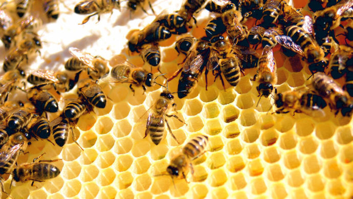
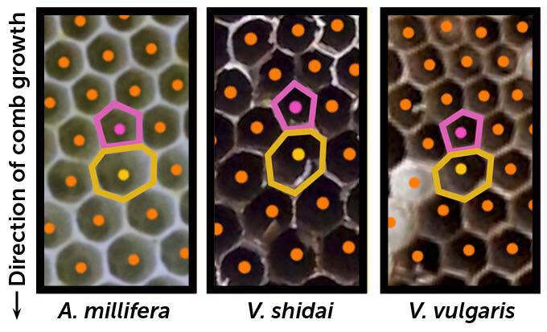
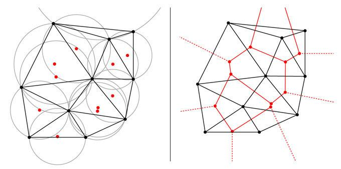

**蜜蜂和黄蜂不像数学家，但它们能用几何学解决建筑难题。**

  
蜜蜂的巢(如图所示)主要由蜡制成的六边形蜂房组成，但也有成对的五边形和七边形蜂房有助于将不同大小的六边形组合在一起。

蜜蜂和黄蜂看起来并不像数学家，它们身形比较小。但是，这些昆虫能够通过几何学的解决方案集体解决一个常见的建筑难题，并独立进化出这种解决方案。

随着它们的群体不断扩大，这些蜜蜂和黄蜂最终需要增加构成它们巢穴的六边形蜂房的大小。但是，巢穴材料昂贵，而且很难将不同大小的六边形蜂房高效地组合成一个连续的数组。研究人员在7月27日的《PLOS 生物学》杂志上报道称，蜜蜂和黄蜂都通过混合一些五边形和七边形的蜂房来解决这个问题，这些蜂房在不同大小的六边形蜂房之间形成了桥梁。团队表示，这种修补方法接近于解决这个问题的最佳方法。

乔治亚大学的蜜蜂生物学家路Lewis Bartlett说：“我们长期以来一直知道，蜜蜂和黄蜂使用的六边形蜂房是最有效、最稳定的形状，但是混合不同大小的六边形却很棘手。”

像蜜蜂和一些黄蜂的社会昆虫群体一样，是由养育母亲女工掌控的。它们在由蜜蜂用蜡制成和由黄蜂用纸张构建的六边形的蜂房里养育后代。在其生命周期的某个时候，群体需要从育成工蜂转变为育成繁殖期的昆虫，如雄蜂和新女王。这些繁殖昆虫通常比工蜂大，这意味着六边形蜂房也需要变大。

  
蜜蜂巢穴的一部分(左)和两种黄蜂的巢穴(中，右)的图像显示出成对的五边形和七边形细胞(突出显示)，它们依偎在六边形细胞中间。 每幅图像的底部朝向巢穴的较新部分，这意味着这些昆虫在七边形细胞之前建造了五边形细胞，以帮助将较小、较老的六边形细胞(顶部)与较大、较新的六边形细胞(底部)连接起来。

阿拉巴马州奥本大学的生物学家Michael Smith说：“想象一下有人在你的浴室地板上铺瓷砖，如果你有两种不同大小的六边形，你会把小的放在一边，大的放在另一边，试图将它们拼凑在一起时就会遇到问题。”

为了找出蜜蜂和黄蜂如何解决这个铺砖难题，Smith和他的同事们分析了115张由五种蜜蜂(Apis mellifera、A. cerana、A. dorsata、A. florea和A. andreniformis)、四种黄蜂(V. vulgaris、V. maculifrons、V. flavopilosa和V. shidai，北美通常称之为黄蜂)和一种纸黄蜂(Metapolybia mesoamerica)构成的群体的图像。

科尔尼尔大学机器人学家克尔Kirstin Petersen开发了自动图像分析工具，使科学家们从22,745个蜂房中提取了数据，如蜂房的长度以及每个蜂房有多少个邻居。Smith还手动验证了每个蜂房的数据。这个自动化工具使团队能够从不完美的蜂房中获取数据，许多科学家因手动测量的困难而忽视了这些似乎不规则的蜂房。但这些看似不规则的蜂房实际上非常规则。

当从小的工蜂蜂房转变为大的繁殖蜂蜂房时，所有的蜜蜂和黄蜂都会建造相邻的五边形和七边形蜂房对来连接不同大小的六边形蜂房。五七配对与两个六边形蜂房连接时具有相同数量的开放边缘，因此不会破坏规律。而七边形蜂房的较大尺寸允许蜜蜂和黄蜂在其另一侧无缝地开始制造更大的六边形蜂房。“它们总是先建造五边形蜂房，然后是七边形蜂房，”Smith说。

同事Nils Napp是科尔尼尔大学的一位计算机科学家，他设计了这种策略的数学模型，并发现蜜蜂和黄蜂正在做的事情接近于最优的几何解决方案。

建立一个六边形蜂房的最有效方法是通过德劳内三角测量来表示。想象一张标有几十个点的纸片。然后，通过连接相邻的点，用三角形填满整个纸片。最后，在每个三角形周围画一个触及每个角的圆。在德劳内三角测量的布局中，没有任何点位于这些圆的内部。连接相邻圆心的额外线条会产生一个由多边形构成的铺设，就像蜜蜂和黄蜂蜂房中的六边形格子一样。

  
在德劳内三角测量(左)中，通过连接相邻的点(黑色)来绘制三角形，并且三角形被布置为使得没有点位于外接每个三角形的圆内。 红点标记了这些圆的中心。 将这些红点连接在一起(右)创建了多边形的平铺(红色)，就像蜜蜂或黄色夹克的巢的六边形。

Napp的模型表明，向蜂房中添加更大的六边形会逐渐使整个数组远离完美，从而可能导致间隙形成或工蜂需要建造一个无法使用的蜂房来维持巢穴的稳定性。最优的做法是在即将违反德劳内条件的时候添加五七配对。在所有蜜蜂和黄蜂物种中，约 85% 的非六边形蜂房都是五七配对，正如该模型预测的那样。

这项研究中使用的蜜蜂和黄蜂相隔了1.79亿年的进化历程，它们用的材料也不同。Bartlett说：“但它们都进化出了使用五七规则来过渡六边形大小的方法。进化倾向于最优解决方案。”