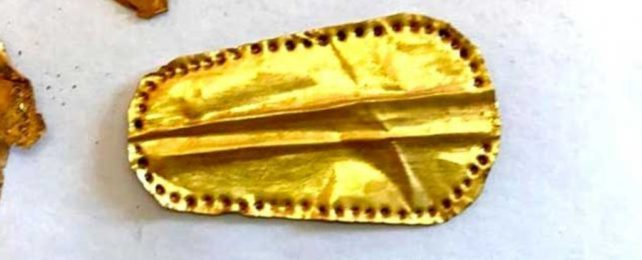
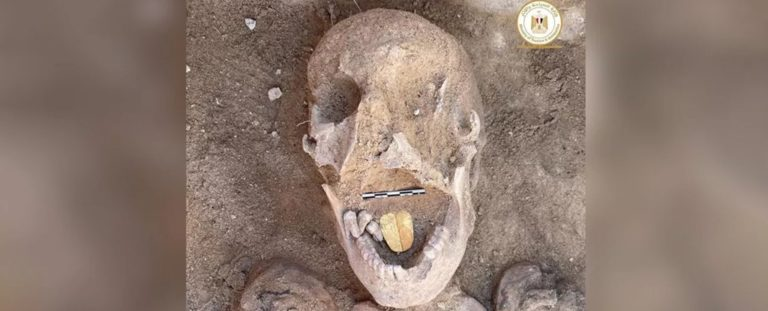
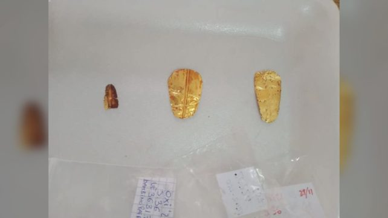

考古学家在埃及发现了几具古老的木乃伊，他们的嘴里有一片黄金舌头。

尼罗河三角洲中部的 Quweisna(有时拼写为 Quesna)墓地遗址于1989年被发现，被认为建于托勒密和罗马占领时期，时间跨度从公元前300年到公元640年。

几具金舌木乃伊是在扩大挖掘点时最新出土的，来自古埃及的三个不同时期，附近还埋葬着其他尸体。一些出土骷髅被镀上了金釉，而另一些则简单地装饰着金甲虫。

黄金舌头有点令人费解，尽管并非没有先例。

2021年初，研究人员在埃及一处2000年前的遗址中，发现了一个头骨，它的嘴里镶着一个闪闪发光的舌形装饰物。

  

然后，在2021年底，再次发现了一男一女和一具儿童木乃伊，带有金舌，距今 2500 多年的历史。

埃及旅游和古物部怀疑是防腐师放置在那里，以确保死者能够度过来世。

今天，“银舌”(相当于汉语里的“巧舌如簧”)被用来形容最有说服力的演说家，但在古埃及，祭祀认为，要想取悦冥界之主和审判者奥西里斯，就必须拥有金舌头。

和希腊的哈迪斯一样，奥西里斯是冥土的统治者，他执行着严格的静默规则。事实上，古埃及的冥界有时被称为“寂静之地”，而奥西里斯本人则被称为“寂静之王”。

奥西里斯讨厌噪音，这就是为什么在古埃及的葬礼中，人们必须保持沉默，以免触怒这位神灵。只有张开木乃伊的嘴为来世做准备时，生者才会奏乐或念诵经文。

也许，只有装上黄金舌头，木乃伊才可以在不发出声音的情况下与奥西里斯交谈。但如果是这样，那为什么只有很少一部分木乃伊配有金舌头呢？

黄金在古埃及是一种流行的材料，用于制作丧葬仪式的装饰品。黄金被认为是众神的肉体成分，特别是太阳神 拉Ra 的皮肤，并与永恒的概念相关。

Ra 是古埃及诸神的领袖，万物的创造者，他与奥西里斯相辅相成。 Ra 代表一天中阳光普照的部分，而 奥西里斯 Osiris 代表黑夜。

也许金色的舌头代表着一条通往光明的路线，即使在阴冷的黑暗中也是如此。

埃及外交部官员表示，在 Quweisna 发现的木乃伊状况不佳，整体保存失败。

他们金色的舌头显然在试图传达一些东西，但我们现在听到的是寂静之声。