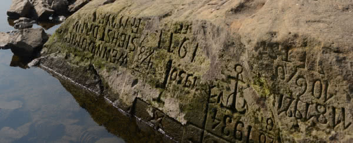

*太阳底下无新鲜事……18年易北河的石头就露出来了，我当时就发过，现在历史重演。*

严重干旱正在使全欧洲的河流萎缩，露出几个世纪前雕刻的石头，石头上的文字是为了向后人预警：**大灾已至**。

据《迈阿密先驱报》报道，上周欧洲的河流因高温而干涸，水落石出，被称为“饥饿石”的、具有数百年历史的巨石显露在人前。

其中一块石头位于中欧主要航运水道之一的易北河，该河始于捷克共和国并流经德国。

这块巨石的历史可以追溯到1616年，并刻有德语警世词：“Wenn du mich seehst, dann weine”（如果你看到我，那就哭吧）

在2013年的一项研究中，捷克的研究人员写道，这些巨石“经过多年侵蚀，仅留有作者姓名首字母”，并补充说“铭文在警告大旱的后果”。

研究人员写道：“干旱带来了歉收、粮食短缺、高价和饥饿。在1900年之前，石碑记录了以下几场干旱：1417、1616、1707、1746、1790、1800、1811、1830、1842、1868、1892 和 1893 年。”

据 NPR 报道，这些“水文地标”最后一次浮出水面是在2018年的干旱期间。

但据欧盟委员会联合研究中心高级研究员安德里亚·托雷蒂(Andrea Toreti)称，目前欧洲正在经历的干旱可能是500年来最严重的一次。

在 8月9日 的新闻发布会上，托雷蒂表示：“当地过去500 年来都没有类似于2018年的大旱。但我认为今年更糟。”

他补充说，在接下来的三个月里，“旱情的风险非常高”。

越来越多的研究将更频繁和更严重的干旱与气候变化联系起来。全球气温上升导致降水变化并增加蒸发量。

根据欧洲干旱观测站的数据，欧洲 47% 的地区处于干旱预警状态，这意味着土壤水分不足；另有 17% 处于戒备状态，这意味着植被受到压力。

饥饿石并不是唯一出现在欧洲河流中的隐藏遗迹。意大利波河因气候变化也显露出一系列考古宝藏。

意大利最大的河流进入70年来最严重的干旱期，达到历史低水位后，一艘二战时期驳船于6月重新浮出水面。

最近，7月下旬，受旱灾影响的意大利河流发现了一枚此前被淹没的二战时期的 1000 磅炸弹。

当地官员告诉路透社：“由于干旱导致水位下降，渔民在波河岸边发现了炸弹。”

专家已安全地将其移除。