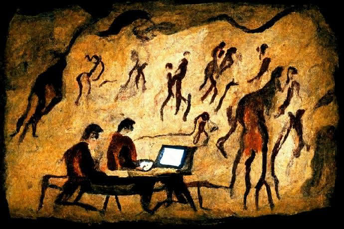
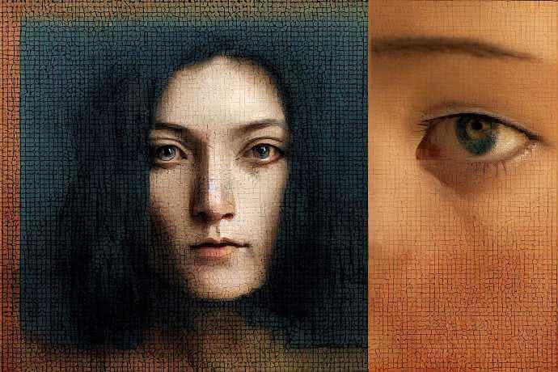

  
*由Midjourney创作的Vilém Flusser(媒介哲学家)肖像*

近几个月来，人工智能生成的文本到图像的艺术作品充斥着互联网，围绕着艺术家在快速变化的世界中的角色诞生了许多话题。我(原作者)最近一直在重温Vilém Flusser在1985年出版的《Into the Universe of Technical Images》(进入技术图像的宇宙)一书，他是一位哲学家和媒体理论家，我第一次遇到他是在电影的背景下，但事实证明，他与当前的人工智能图像模型浪潮以及它们所提出的关于创造力、艺术和劳动的问题有着惊人的相关性。仔细阅读Flusser的预言性文字可以帮助回答其中的一些问题，并澄清艺术家在快速到来的未来中的角色。

## 传统图像、技术图像

  
*由Midjourney创作*

Flusser把文化史描述为五个阶段：

1. 动物和原始人为主体。
2. 古人类(大约200万到4万年前)为主体，创作以石刀和雕刻的人物为主。
3. 智人为主体，创作特点是传统图片，如洞穴壁画。
4. 大约四千年前，在人类和其图像作品之间引入了线性文本，比如荷马史诗和圣经。线性文本标志着我们所知道的文明和历史的开始。
5. 近期人们发现文本是不可接近(inaccessible)的。它们不容许进一步的图解，它们变得不再清晰，它们坍塌成必须收集起来的颗粒。这是计算和算力的阶段，也就是所谓技术图像。

## 颗粒与像素

  
*由Midjourney创作*

传统的绘画图像具有凝聚的物理性，而技术图像则是颗粒的短暂排列：无论是相机的感光化学品或传感器捕捉的光子，显示器上亮起的像素，还是人工智能图像产生的高斯噪声模式，技术图像都是颗粒数据的重组，只能达到一个虚幻的整体性。它们总是可以被还原为构成它们的颗粒。

Flusser在这里指的是他那个时代的相机和其他技术，但同样的原理也直接适用于人工智能在图像数据集上的训练方式，即创建一个由漂浮在云中的经过训练的“颗粒”组成的网络，然后通过提示重新组装成新的图像。因此，我们可以看到人工智能文本到图像模型不是一个全新的现象，而是技术图像作为粒子重新组合的自然顶点。与其他技术图像如照片相比，区别不在于种类，而在于程度——访问的规模、使用的便利性和可能的图像数量(无限)。

> “技术图像的制作者，那些想象的人(摄影师、摄像师、视频制作者)，实际上已经走到了历史的尽头。在未来，每个人都将想象。每个人都将能够使用按键，允许他们与其他人一起在计算机屏幕上合成图像。”

人工智能图像合成仍处于起步阶段，但它正在以惊人的速度发展，我们离每个人都将一直使用人工智能来生成图像的未来不远了。如果这是未来，甚至是现在，我们如何定位现有艺术家现在和未来的角色？

## 艺术家的神话

  
*由Midjourney创作*

> “可以远程操控的图像可能会产生一种至今仍不可想象的艺术，一种比线性历史对话丰富得多的图像对话。这样一个通过图像对话的社会将是一个艺术家的社会。它将通过图像对话地设想从未见过、无法预测的情况。”

在即将到来的未来，任何人都有能力通过几次按键来生成高质量的图像或视频，这威胁到“艺术家”作为单一创作者的地位，一个人花了很多时间来发展他们的技术技能和独特的观点。这种对艺术家概念的存在性破坏是围绕文本到图像模型争论的中心。围绕这一转变的影响的对话现在正在网上热烈展开，但Flusser向我们展示了这种转变在他近40年前写作时就已经很好地进行了。几十年来，资本主义的动机结构、技术进步和互联网一直在改变艺术家的角色和他们的生计，而人工智能艺术只是这些力量的最新表现。但是，作为这一划时代转变的转折点，它实际上可以提供一个通往真正革命性事物的大门，而不是在我们脚下摇摇欲坠的制度基础上的另一个创可贴。

> “现在出现的社会结构代表着辐射图像与坐在这些射线末端的分散、孤独、非人格化的人的同步。革命性的视觉化试图以这样一种方式用另一种结构取代这种结构，即图像带来新的人际关系，并导致新的社会结构，这些结构的名称目前还不清楚。”

Flusser在这里说的是(80年代)集中式分配渠道单向对外广播的状态(即电视、电影、广播)，让位于更分散和参与性更强的东西。在互联网发明的风口浪尖上写作，他已经可以看到技术图像将成为新的沟通手段，最终取代了线性文本。正如我们所看到的表情符号和模因，识字率的下降，视频平台如Youtube和TikTok的崛起，以及图片分享平台如Instagram，Tumblr和Pinterest的突出，无可争辩的是，互联网通过技术图像将全球人口带入了对话。

这些新的平台一直在颠覆长期以来关于在哪里以及如何在艺术中发现和分享意义的价值观，特别是对于新的技术文盲一代。拥有大量观众的 "伟大艺术家 "的时代已经衰落了一段时间，互联网培养了一种互动的、相互联系的小众社区文化，而不是单向的单一文化。而到目前为止，决定和规范价值的旧机构迟迟不能完全适应。人工智能将加速这种分裂，并使未来更加细化——而不是像20世纪那样，在一个线性的时间轴上散布伟大的艺术家名单，每时每刻都将爆发出艺术家的作品，他们的作品在各个方向上产生共鸣和交叉感染，形成越来越小的利基。随着艺术家如何赚钱、观众如何花钱以及外部组织的作用等模式的不断变化，不变的是艺术本身，以及它为从业者和观众产生意义的能力。

### 作为策展人的艺术家

  
*由Midjourney创作*

> “因为从现在起，人类的自由不再在于能够按照自己的愿望来塑造世界(机器在这方面做得更好)，而在于能够按照所期望的形式来指导(编程)机器，并在这种形式已经产生时停止(控制)机器。”

与其他任何媒介相比，人工智能文本到图像的合成揭示了一个真理，即所有艺术都是真正的策展。艺术家从世界中吸收影响——从经验、记忆、其他艺术作品中——并通过一种媒介将它们合成为一种新形式。

### 传统图像

最明显地体现了脑力劳动转化为物质形式：当我们看一幅画时，我们会感觉到人手的直接作用，我们会被在特定的时间和地点发生的协调一致的体力劳动的记录所理解。2形式的选择在最后的图像中立刻显现出来。

### 技术图像

就像照片一样，它也揭示了艺术家的手，但更抽象、更间接：当我们看一张照片时，我们会感觉到一种没有人手的视觉，因为技术图像的媒介是黑盒子，程序在那里不可见地发生。一张照片是在瞬间创造出来的，而不是随着时间的推移而应用的笔触，因此，在艺术家/操作者做出的每个选择中，直到他们按下快门按钮的那一刻，都可以追溯地感觉到人的触摸。此时相机的黑匣子内的程序自动运行。

### AI图像

以同样的方式工作——操作员在构建提示时做出选择，最后一次击键后自动生成图像。技术机制与摄影不同，但过程在结构上是相同的——导致程序在黑盒中运行的那一刻的人类决策的总和。

我们可以将图像创建中的这些决策定义为策展——有意识地将无限的选择缩小到一个有意想要的结果。固化同时发生在艺术家和他们的媒介中，两者相辅相成。艺术家通过自己的内在自我来塑造创作的瞬间，媒介的内在品质则决定了所产生的图像的品质。艺术家通过媒介的选择来限制自己。而媒介又通过自身的限制来限制它们。艺术是在这两个层面的策展协调的空间中出现的。

显然，在某种程度上，我们每天都是艺术家，每当我们无所事事地用手机涂鸦或拍照时，我们通常认为“艺术家”是这样的人，经过时间和实践，在他们的内在自我和他们选择的媒介中策划了一个深度，以产生一个特殊的和谐结果，在观众中产生意义和情感。最重要的艺术家将以他们独特的方式这样做，策划的结果可能是公认的只有来自他们。

## 艺术与资本

  
*由DALL-E 2创作*

当我们考虑到在资本主义背景下工作的艺术家时，艺术家的定义变得更加模糊；因为严格来说，艺术并不是 "有用的"，艺术家和资本之间一直存在着不稳定的伙伴关系，而且大多数工作的艺术家的劳动被众所周知地低估了。我们首先应该承认，这个系统已经坏了--人工智能并没有突然闯入，破坏一个对所有人都很好的机器。当涉及到技术变革时，在职艺术家的角色总是不稳定的——例如，CGI艺术家在好莱坞的崛起取代了实际的特效艺术家、哑光画家和定格动画师。但是，虽然确实有一些工作失去了，但这并不是黑白分明的——许多旧式的艺术家要么适应了新技术，要么能够利用他们的经验担任监督职务：他们辛苦获得的知识，他们的深度策划，仍然转化为新的背景。从一开始，艺术就不是一个稳定的职业，变化是唯一不变的。

人们通过艺术工作赚钱的方式有无数种，对于人工智能将如何影响不同的行业，没有一刀切的答案。许多人认为，目前形式的人工智能艺术直接威胁到某些类别的艺术工作，如概念艺术家或故事板艺术家——但试图省钱的企业已经在Fiverr上将这些角色外包到海外，或以其他方式偷工减料，那些关心艺术和人的公司会找到一种方法来使用它们。人类艺术家可能成为有能力的企业的奢侈品，内部提示艺术家可能很快成为一个职位，或者情况可能保持相对类似，现有的艺术家只是将人工智能纳入他们的工作流程，作为构思或迭代的一个工具。事情将如何发展的确切机制尚不清楚，但肯定不会因为每家公司都开始使用人工智能而在一夜之间，训练有素的艺术家再也找不到工作。

无论是试图谋生的在职艺术家、在画廊展出的美术家，还是为艺术而创作的业余爱好者，艺术的核心功能仍然存在；但无论在哪里实施，人工智能将使其生产和分享的速度成倍提高，使艺术更加社会化，不那么珍贵和稀缺，并且可以无止境地修改。这是从集中式广播传播渠道的单向模式，全面过渡到分散的社会交流网络，插上翅膀就不像过去艺术生产中的孤独内省，而更像在玩游戏。

## 作为游戏的艺术：《游戏人(Homo Ludens)》 的崛起

  
*由Craiyon创作*

> “未来的人，在键盘上弹奏，未来的人将沉浸在创造过程中，达到忘我的地步，他将站起来，通过这些装置与他人一起玩耍，因此，将这种在玩耍中的忘我视为自我的丧失是错误的。相反，未来的存在者将通过游戏发现自己，充实自己，“我”，即本质还原(以及神经心理学、心理学和信息学分析)已经证明是一个抽象的概念，是虚无的，将通过创造性的游戏首次实现。”

在推测技术图像的未来时，Flusser一次又一次地提到“游戏”这个词。任何从事过艺术的人都可以认识到，创造力在其最纯粹的形式上就是游戏——一种不自觉的、孩子般的与媒介的无限可能性的接触，重新安排元素以创造出新的东西。任何使用过文本到图像模式的人都可以认识到同样的感觉。放大和提炼。模型提供了一个简单和深度的惊人平衡，提供了比其他媒体更多的即时满足。这是令人难以置信的乐趣将戏剧置于最前沿，并将经常困扰创作过程的挫折感降到最低。结合互联网的网络可能性，Flusser对未来的愿景是一种集体的自我死亡，在这种情况下，形象制作的社会游戏取代了过时的孤立的艺术创作过程。

> “未来的图像将处于高水平，因为它们的生产将归功于嵌入仪器的理论和设想的直观幻觉力量之间的辩证关系……那里的创作将不限于少数'伟大的人'，他们通过孤独的内心对话，以经验性的方式生产信息性的作品。……相反，每个人都将参与到创作过程中，用仪器中体现的理论来检验他们的直觉和灵感，而这些理论的丰富性我们还没有摸清。”

重要的是，游戏往往是社会性的。大多数人都以某种形式对社交媒体的互动性质感到有趣。现在许多艺术家接触观众的方式是通过在社交媒体渠道上在各种社区中传播他们的内容。Midjourney的Discord频道的群聊结构是Flusser设想的一个相当直白的例子，用户实时分享和互动对方的图像。网络应用DALL-E Mini(改名为Craiyon)在社交媒体上有一个病毒式的时刻，用户分享3x3网格的低质量生成的图像，通常是备忘录式的或与流行文化有关。这是Flusser预言的那种对话式交流的一个完美例子。作者是匿名的，任何人都可以参与到创造和分享图像的游戏中，而且赌注不是金钱。这纯粹是为了好玩。

仔细观察Craiyon的成功，重要的是要理解为什么这些图片特别能引起广大观众的共鸣，尽管它们比许多更闪亮、更干净的DALL-E或Midjourney图片 "质量低下"，而这些图片往往只是积灰。Craiyon的技术限制迫使人们更加强调对自我的策划，以创造和谐。图像的松散、不可思议的性质使它们更适合于搞笑的提示，作为个性而不是美的载体。克雷永的备忘录式图像证明，使图像产生共鸣的并不完全是图像的技术掌握，有时恰恰相反。

## 图像的未来

  
*由Midjourney创作*

> “在目前的第一阶段，技术形象还可以通过汲取历史来不断更新自己。但历史即将枯竭，这正是因为形象在汲取历史，因为它们像寄生虫一样坐在历史的线上，把历史重新编码成圆圈。一旦这些圆圈闭合，形象与人的互动实际上将成为一个封闭的反馈回路。图像总是显示同样的东西，人们总是想看到同样的东西...”

Flusser的文章提供了两种可能的技术形象的结果——一个乌托邦和一个反乌托邦。我们已经在反乌托邦的下降到封闭的反馈循环的中间，并且已经有一段时间了;只要看看好莱坞的现状，怀旧的特许经营IP无休止的循环，或者流媒体网站是数据驱动的、算法策划的“内容”，AI要么是棺材上的最后一颗钉子，要么是一条出路。

> “目前图像与人之间的相互作用将导致接受图像的人丧失历史意识，因此也会丧失接受图像可能产生的任何历史行动。但是，目前的这种相互作用尚未导致新意识的发展，除非它发生根本性的变化。除非反馈被打断，图像开始在人与人之间进行调解。图像与人之间的魔法圈的这种断裂是我们面临的任务，这种断裂不仅在技术上是可能的，而且最重要的是在存在上是可能的。”

Flusser的预测唤起了我们在互联网上已经面临的令人麻木的内容疲劳，随着人工智能内容不可避免的泛滥，这种疲劳即将升级。我们有可能被淹没在其中，但在当前的拐点，如果我们能看清形势，我们仍然有机会将事情朝着更乌托邦的方向发展。关键是不要将人工智能图像视为历史偏差，而是技术图像革命的必然一步，从这个角度来看，艺术家们有机会拥抱这些新的工具，发挥它们的无限潜力，通过新的想象方式，新的集体想象价值和意义的方式，打破创作停滞。

## 一场精神革命

  
*由Midjourney创作*

> “每一场革命，无论是政治的、经济的、社会的、美学的，归根结底都是一场技术革命。如果你看看人类经历过的大革命，比如说新石器时代的革命，或者说青铜时代的革命，或者说铁器时代的革命，或者说工业革命，每一场革命实际上都是一场技术革命。现在的这场革命也是。  
> 但有一点不同。到目前为止，技术一直是模拟身体的。这是第一次，我们的新技术模拟神经系统。所以，这是第一次，一个真正的，如果你想这么说，一个真正的非物质，用一个更古老的术语，精神革命。”  
> ——Vilém Flusser于1988年的访谈

我们正站在一场革命的风口浪尖上，这个位置从本质上来说是很难预测的。这种不确定性需要导航工具，我希望这篇关于Vilém Flusser的简短介绍可以作为指南针，通过为AI艺术话语添加一些更广泛的理论背景，帮助引导对话。并为许多艺术家对这种情况的绝望和蔑视提供了一剂解药。我们需要正视人工智能艺术存在的现实，它不会消失--但这并不意味着“艺术已死”。艺术历经数千年的技术进步而幸存下来，可以说在这些转型时刻是最有生命力和活力的。只要有人类，就会有艺术。如果我们要相信Flusser(我认为我们应该这样做，考虑到他的观点的准确性)，那么我们就可以对艺术的未来和人工智能在其中的作用持乐观态度，如果我们以正确的方式将深思熟虑、谨慎和希望结合起来的话。